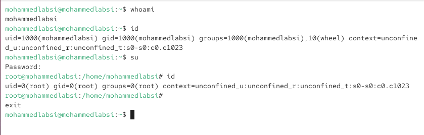
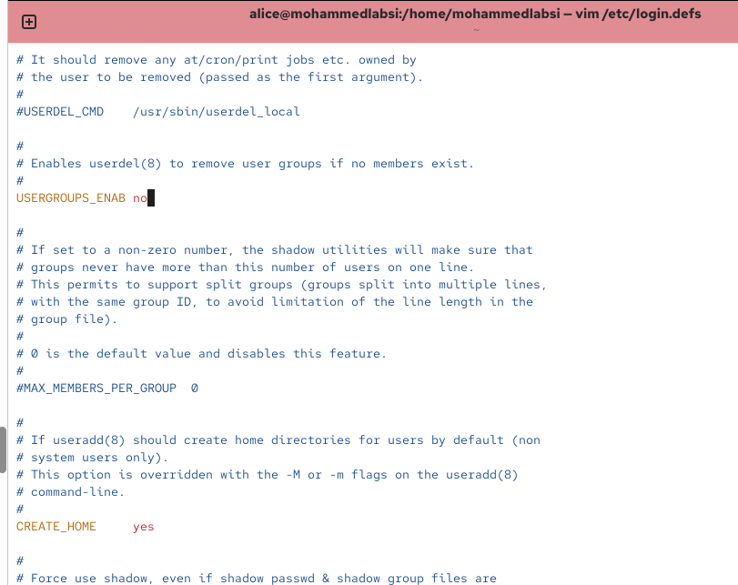
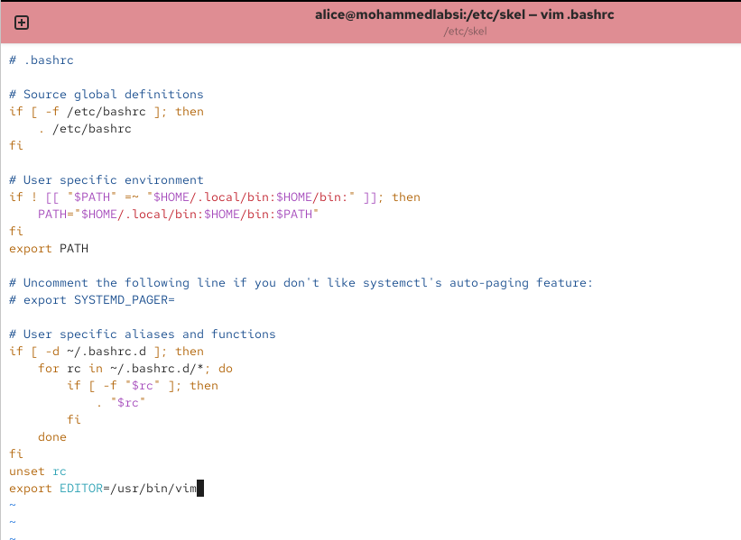
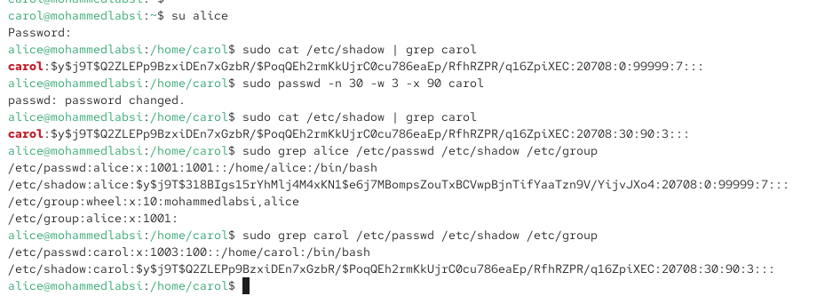
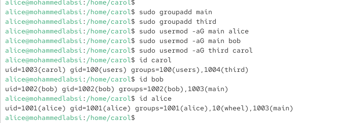

---
## Author
author:
  name: Лабси Мохаммед
  email: 1032245412@rudn.ru
  affiliation:
    - name: Российский университет дружбы народов
      country: Российская Федерация
      postal-code: 117198
      city: Москва
      address: ул. Миклухо-Маклая, д. 6

## Title
title: Лабораторная работа №2
subtitle: Управление пользователями и группами
license: CC BY
date: today
date-format: "YYYY-MM-DD"
---

# Цели и задачи работы

## Цель лабораторной работы

Получить практические навыки управления пользователями и группами в Linux.

# Процесс выполнения лабораторной работы

## Определяю текущего пользователя

{ #fig:001 width=70% height=70% }

## Просматриваю файл sudoers

{ #fig:002 width=70% height=70% }

## Создаю пользователей alice и bob

{ #fig:003 width=70% height=70% }

## Настраиваю параметры создания пользователей

{ #fig:004 width=70% height=70% }

## Изменяю шаблонный файл .bashrc

{ #fig:005 width=70% height=70% }

## Создаю пользователя carol

{ #fig:006 width=70% height=70% }

## Настраиваю параметры пароля carol

{ #fig:007 width=70% height=70% }

## Создаю группы и добавляю пользователей

{ #fig:008 width=70% height=70% }

# Выводы по проделанной работе

## Вывод

В ходе лабораторной работы были изучены команды `whoami`, `id`, `su`, `sudo`, `useradd`, `passwd`, `groupadd` и `usermod`.

Были созданы пользователи `alice`, `bob` и `carol`, настроены права администратора через группу `wheel`, изменены параметры создания новых пользователей и выполнена работа с группами `main` и `third`.