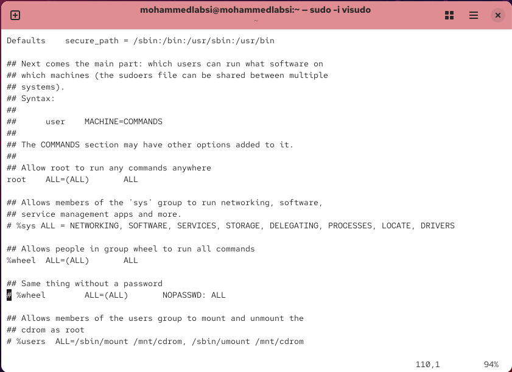
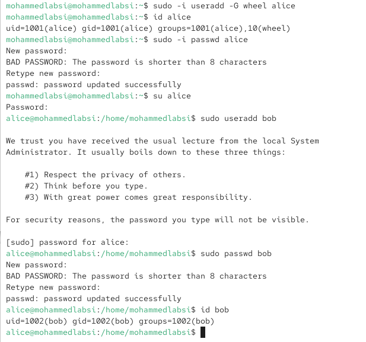
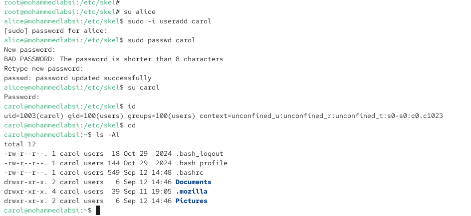

---
## Author
author:
  name: Лабси Мохаммед
  email: 1032245412@rudn.ru
  affiliation:
    - name: Российский университет дружбы народов
      country: Российская Федерация
      postal-code: 117198
      city: Москва
      address: ул. Миклухо-Маклая, д. 6

## Title
title: "Отчёт по лабораторной работе №2"
subtitle: "Управление пользователями и группами"
license: "CC BY"
---

# Цель работы

Целью данной работы является приобретение практических навыков установки Rocky Linux на виртуальную машину с помощью инструмента Vagrant.

# Выполнение лабораторной работы

## Переключение учётных записей пользователей

Открываю терминал и определяю текущую учётную запись с помощью команды `whoami`. В системе используется пользователь `mohammedlabsi`. Для получения более подробной информации выполняю команду `id` (см. рис. [@fig-001]).

Команда `id` показывает идентификатор пользователя `uid=1000(mohammedlabsi)`, идентификатор основной группы `gid=1000(mohammedlabsi)` и список дополнительных групп. Пользователь входит в группу `wheel` с идентификатором `10`, что позволяет ему получать административные полномочия с помощью `sudo`. Также отображается контекст безопасности SELinux.

После этого с помощью команды `su` переключаюсь на учётную запись суперпользователя `root` и повторно выполняю `id`. Для пользователя `root` значения UID и GID равны `0`, что соответствует суперпользователю с максимальными полномочиями в системе. Затем командой `exit` возвращаюсь к обычной учётной записи.

{ #fig-001 width=70% }

Для безопасного просмотра и изменения файла `/etc/sudoers` запускаю команду `sudo -i visudo`. В файле присутствует строка `%wheel ALL=(ALL) ALL` (см. рис. [@fig-002]).

Утилита `visudo` используется вместо обычного текстового редактора, поскольку перед сохранением она проверяет синтаксис файла `/etc/sudoers`. Ошибка в данном файле может привести к невозможности дальнейшего использования команды `sudo`, поэтому его непосредственное редактирование произвольным редактором нежелательно.

Запись `%wheel ALL=(ALL) ALL` означает, что все пользователи группы `wheel` могут на любых узлах выполнять любые команды от имени любого пользователя после прохождения аутентификации. Группа `wheel` традиционно используется для предоставления обычным пользователям административных полномочий.

Также в файле присутствует закомментированный вариант `%wheel ALL=(ALL) NOPASSWD: ALL`, который при включении позволил бы членам группы `wheel` выполнять команды через `sudo` без ввода пароля.

{ #fig-002 width=70% }

Создаю пользователя `alice` и сразу добавляю его в дополнительную группу `wheel` командой:

`sudo -i useradd -G wheel alice`

Проверяю параметры созданной учётной записи командой `id alice`. Пользователь имеет `uid=1001`, основную группу `alice` с `gid=1001` и входит в дополнительную группу `wheel` с GID `10`.

Задаю пароль пользователю `alice` с помощью `sudo -i passwd alice`, после чего переключаюсь на его учётную запись командой `su alice`.

Находясь под пользователем `alice`, создаю пользователя `bob` командой `sudo useradd bob`, устанавливаю ему пароль с помощью `sudo passwd bob` и проверяю параметры командой `id bob` (см. рис. [@fig-003]). Пользователь `bob` имеет `uid=1002` и основную группу `bob` с `gid=1002`.

{ #fig-003 width=70% }

## Создание учётных записей пользователей

Переключаюсь на учётную запись `root` и открываю файл `/etc/login.defs` для редактирования. Устанавливаю параметр `USERGROUPS_ENAB` в значение `no` и убеждаюсь, что параметр `CREATE_HOME` имеет значение `yes` (см. рис. [@fig-004]).

Параметр `CREATE_HOME yes` задаёт автоматическое создание домашнего каталога при создании нового пользователя. Параметр `USERGROUPS_ENAB no` отключает схему создания для каждого нового пользователя одноимённой основной группы. В результате для новых пользователей в качестве основной может использоваться общая группа `users`.

{ #fig-004 width=70% }

Перехожу в каталог `/etc/skel`. Содержимое этого каталога используется как шаблон при создании домашних каталогов новых пользователей. В нём создаю каталоги `Pictures` и `Documents`.

Затем редактирую файл `/etc/skel/.bashrc` и добавляю строку:

`export EDITOR=/usr/bin/vim`

Эта переменная окружения задаёт редактор `vim` в качестве редактора по умолчанию для программ, использующих переменную `EDITOR` (см. рис. [@fig-005]). Так как файл находится в `/etc/skel`, данная настройка будет автоматически скопирована в домашние каталоги вновь создаваемых пользователей.

{ #fig-005 width=70% }

Переключаюсь на пользователя `alice` и создаю нового пользователя `carol` командой `sudo -i useradd carol`. После этого задаю пароль с помощью `sudo passwd carol`.

Переключаюсь на пользователя `carol` и выполняю команду `id`. Пользователь получил `uid=1003(carol)`, а его основной группой стала общая группа `users` с идентификатором `gid=100`. Это является результатом установки параметра `USERGROUPS_ENAB no`.

Перехожу в домашний каталог пользователя и выполняю `ls -Al`. В домашнем каталоге присутствуют стандартные файлы `.bash_logout`, `.bash_profile`, `.bashrc`, а также каталоги `Documents` и `Pictures`, ранее добавленные в `/etc/skel` (см. рис. [@fig-006]). Следовательно, содержимое каталога-шаблона было успешно скопировано при создании пользователя.

{ #fig-006 width=70% }

Переключаюсь обратно на пользователя `alice` и просматриваю запись пользователя `carol` в файле `/etc/shadow` с помощью команды:

`sudo cat /etc/shadow | grep carol`

Строка файла `/etc/shadow` содержит несколько полей, разделённых символом `:`. Первое поле содержит имя пользователя `carol`, второе — хеш пароля. Следующее числовое поле задаёт дату последнего изменения пароля в количестве дней с 1 января 1970 года. Далее располагаются минимальный срок до разрешённой смены пароля, максимальный срок действия пароля, срок предупреждения перед истечением пароля, период неактивности, дата блокировки учётной записи и резервное поле.

Первоначально для `carol` были установлены стандартные значения минимального срока `0`, максимального срока `99999` дней и периода предупреждения `7` дней.

Изменяю параметры пароля командой:

`sudo passwd -n 30 -w 3 -x 90 carol`

После изменения повторно просматриваю `/etc/shadow`. В записи пользователя появляются значения `30:90:3`, означающие:

- `30` — пароль нельзя изменить раньше чем через 30 дней после предыдущей смены;
- `90` — пароль действует не более 90 дней;
- `3` — за 3 дня до окончания срока действия пользователь начинает получать предупреждения.

Далее выполняю поиск пользователей `alice` и `carol` в файлах `/etc/passwd`, `/etc/shadow` и `/etc/group` (см. рис. [@fig-007]).

Пользователь `alice` присутствует во всех трёх файлах. В `/etc/passwd` находится основная информация об учётной записи, в `/etc/shadow` — защищённая информация о пароле, а в `/etc/group` присутствуют записи о группах `wheel` и `alice`.

Пользователь `carol` присутствует в `/etc/passwd` и `/etc/shadow`, однако отдельной группы `carol` в `/etc/group` нет. Его основной группой является существующая группа `users` с GID `100`, поэтому создавать отдельную одноимённую группу не требуется.

{ #fig-007 width=70% }

## Работа с группами

Находясь под пользователем `alice`, создаю две новые группы:

`sudo groupadd main`

`sudo groupadd third`

После этого добавляю пользователей в дополнительные группы командами:

`sudo usermod -aG main alice`

`sudo usermod -aG main bob`

`sudo usermod -aG third carol`

Ключ `-G` задаёт список дополнительных групп пользователя, а ключ `-a` обеспечивает добавление к уже существующим дополнительным группам без удаления пользователя из них.

Проверяю членство пользователей в группах командами `id carol`, `id bob` и `id alice` (см. рис. [@fig-008]).

Пользователь `carol` имеет `uid=1003`, основную группу `users` с `gid=100` и дополнительную группу `third` с `gid=1004`.

Пользователь `bob` имеет `uid=1002`, основную группу `bob` с `gid=1002` и дополнительную группу `main` с `gid=1003`.

Пользователь `alice` имеет `uid=1001`, основную группу `alice` с `gid=1001`, а также входит в дополнительные группы `wheel` с `gid=10` и `main` с `gid=1003`. Таким образом, пользователь `alice` сохраняет административные полномочия через группу `wheel` и одновременно является участником созданной группы `main`.

{ #fig-008 width=70% }

## Контрольные вопросы

1. **При помощи каких команд можно получить информацию о номере (идентификаторе), назначенном пользователю Linux, и о группах, в которые он включён?**  
   Для получения информации об идентификаторе пользователя и его группах используются команды **id**, **whoami** и **groups**.  
   Команда **id** выводит UID пользователя, его основной GID и список всех дополнительных групп.  
   Команда **whoami** отображает имя текущего пользователя, а **groups** показывает перечень групп, в которые он входит.

2. **Какой UID имеет пользователь root? При помощи какой команды можно узнать UID пользователя? Приведите примеры.**  
   Пользователь **root** имеет идентификатор **UID = 0**.  
   Узнать UID пользователя можно с помощью команды **id**, например: **id root** или **id alice**.  
   В выводе команды значение **uid=0** однозначно указывает на суперпользователя.

3. **В чём состоит различие между командами su и sudo?**  
   Команда **su** выполняет переключение на другую учётную запись (чаще всего на **root**) и требует ввода пароля целевого пользователя.  
   Команда **sudo** позволяет выполнять отдельные команды с повышенными привилегиями от имени **root** или другого пользователя, используя пароль текущего пользователя и в соответствии с настройками безопасности.

4. **В каком конфигурационном файле определяются параметры sudo?**  
   Основные параметры и правила использования **sudo** задаются в конфигурационном файле **/etc/sudoers**, а также в дополнительных файлах каталога **/etc/sudoers.d/**.

5. **Какую команду следует использовать для безопасного изменения конфигурации sudo?**  
   Для безопасного редактирования конфигурации **sudo** используется команда **visudo**.  
   Она выполняет проверку синтаксиса файла перед сохранением и предотвращает появление ошибок, которые могут заблокировать использование **sudo**.

6. **Если вы хотите предоставить пользователю доступ ко всем командам администрирования системы через sudo, членом какой группы он должен быть?**  
   Пользователь должен входить в группу **wheel**, так как строка  
   **%wheel ALL=(ALL) ALL**  
   в файле **/etc/sudoers** разрешает всем членам этой группы выполнять любые команды с использованием **sudo**.

7. **Какие файлы и каталоги используются для определения параметров, применяемых при создании учётных записей пользователей? Приведите примеры настроек.**  
   Основные параметры создания пользователей определяются в файле **/etc/login.defs**, например **CREATE_HOME** и **USERGROUPS_ENAB**.  
   Каталог **/etc/skel** содержит шаблонные файлы и каталоги, которые автоматически копируются в домашний каталог нового пользователя, такие как **.bashrc**, **Pictures** и **Documents**.

8. **Где хранится информация о первичной и дополнительных группах пользователей Linux? Приведите пояснение для пользователя alice.**  
   Информация о пользователях хранится в файле **/etc/passwd**, а сведения о группах — в файле **/etc/group**.  
   Для пользователя **alice** в файле **/etc/passwd** указана его основная группа, а в файле **/etc/group** перечислены дополнительные группы, такие как **wheel** и **main**, в которых он состоит.

9. **Какие команды можно использовать для изменения информации о пароле пользователя (например, срока его действия)?**  
   Для изменения параметров пароля используется команда **passwd** с дополнительными ключами, например **-n**, **-w** и **-x**.  
   Также для просмотра и изменения информации о сроке действия пароля может применяться команда **chage**.

10. **Какую команду следует использовать для прямого изменения информации в файле /etc/group и почему?**  
    Для безопасного изменения файла **/etc/group** используется команда **vigr**.  
    Она блокирует файл на время редактирования и выполняет проверку корректности формата, что предотвращает повреждение системной конфигурации.

# Заключение

В ходе лабораторной работы были изучены и отработаны основные приёмы управления учётными записями и группами пользователей в ОС Linux. Выполнено переключение между пользователями, настройка прав суперпользователя с использованием **su** и **sudo**, а также анализ конфигурационных файлов **/etc/sudoers**, **/etc/login.defs** и **/etc/skel**. Созданы новые пользователи и группы, настроены параметры паролей и права доступа к каталогам. Полученные результаты подтверждают корректную работу механизмов аутентификации, авторизации и разграничения доступа в системе.
