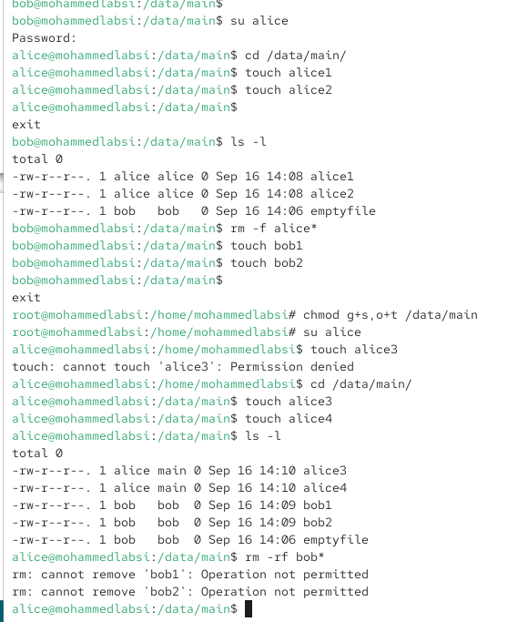
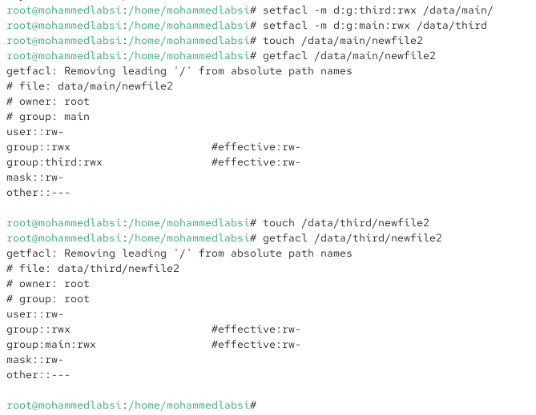

---
## Author
author:
  name: Лабси Мохаммед
  email: 1032245412@rudn.ru
  affiliation:
    - name: Российский университет дружбы народов
      country: Российская Федерация
      postal-code: 117198
      city: Москва
      address: ул. Миклухо-Маклая, д. 6

## Title
title: Лабораторная работа №3
subtitle: Настройка прав доступа
license: CC BY
date: today
date-format: "YYYY-MM-DD"
---

# Цели и задачи работы

## Цель лабораторной работы

Получить практические навыки настройки прав доступа в Linux.

# Процесс выполнения лабораторной работы

## Настраиваю базовые разрешения

{ #fig:001 width=70% height=70% }

## Проверяю специальные разрешения

{ #fig:002 width=70% height=70% }

## Настраиваю ACL для каталогов

{ #fig:003 width=70% height=70% }

## Проверяю права новых файлов

{ #fig:004 width=70% height=70% }

## Настраиваю ACL по умолчанию

{ #fig:005 width=70% height=70% }

## Проверяю доступ пользователя carol

{ #fig:006 width=70% height=70% }

# Выводы по проделанной работе

## Вывод

В ходе лабораторной работы были изучены команды `chgrp`, `chmod`, `getfacl` и `setfacl`.

Были настроены базовые права доступа, изменены группы-владельцы каталогов, применены специальные разрешения SGID и sticky bit, а также настроены расширенные списки ACL для групп `main` и `third`.