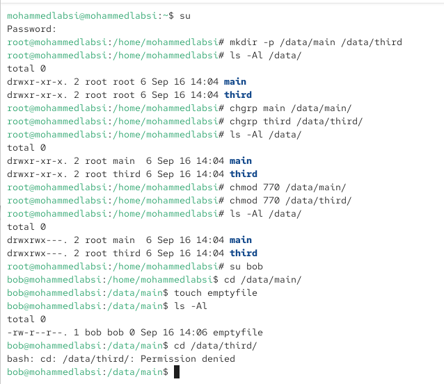
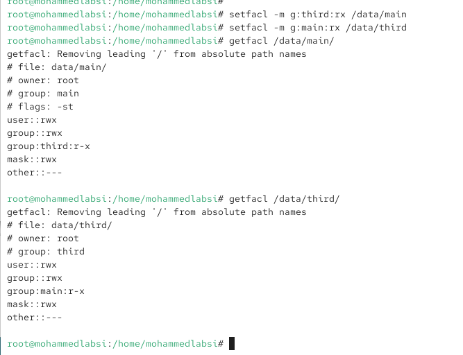
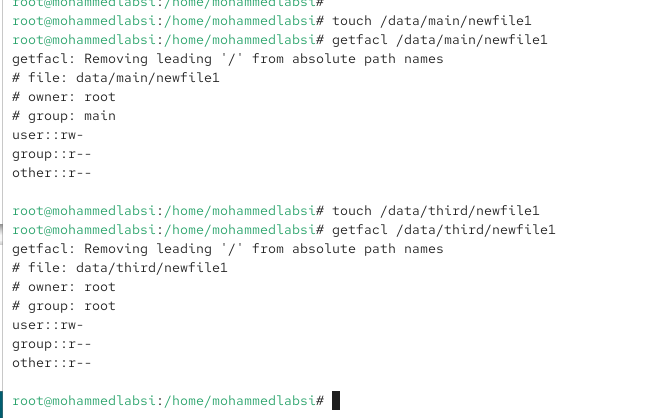
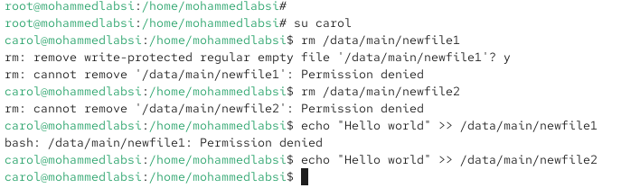

---
## Author
author:
  name: Лабси Мохаммед
  email: 1032245412@rudn.ru
  affiliation:
    - name: Российский университет дружбы народов
      country: Российская Федерация
      postal-code: 117198
      city: Москва
      address: ул. Миклухо-Маклая, д. 6

## Title
title: "Отчёт по лабораторной работе №3"
subtitle: "Настройка прав доступа"
license: "CC BY"
---

# Цель работы

Получение навыков настройки базовых и специальных прав доступа для групп пользователей в операционной системе типа Linux.

# Выполнение лабораторной работы

## Изучение справочной документации по управлению правами доступа

Перед выполнением практической части изучаю справочные страницы команд `chgrp`, `chmod`, `getfacl` и `setfacl` с помощью команд:

`man chgrp`

`man chmod`

`man getfacl`

`man setfacl`

Команда `chgrp` предназначена для изменения группы-владельца файла или каталога. В качестве аргументов указываются имя группы и объект, для которого необходимо изменить принадлежность к группе.

Команда `chmod` используется для изменения стандартных прав доступа к файлам и каталогам. Права можно задавать как в символьной форме, например `g+s` или `o+t`, так и в числовой форме, например `770`. Также с помощью `chmod` устанавливаются специальные биты доступа: SUID, SGID и sticky bit.

Команда `getfacl` позволяет просматривать стандартные и расширенные списки контроля доступа ACL для файлов и каталогов. В выводе отображаются владелец, группа-владелец, стандартные права и дополнительные записи ACL для пользователей и групп.

Команда `setfacl` используется для создания, изменения и удаления записей ACL. Параметр `-m` изменяет список доступа, а префикс `d:` позволяет задавать ACL по умолчанию для каталога, которые будут наследоваться создаваемыми в нём объектами.

## Управление базовыми разрешениями

Переключаюсь на учётную запись суперпользователя с помощью команды `su`. После успешной аутентификации создаю каталоги `/data/main` и `/data/third`:

`mkdir -p /data/main /data/third`

Проверяю владельцев и права доступа командой `ls -Al /data`. Сразу после создания оба каталога принадлежат пользователю `root` и группе `root` (см. рис. [@fig-001]).

Для каталога `/data/main` изменяю группу-владельца на `main`, а для `/data/third` — на `third`:

`chgrp main /data/main/`

`chgrp third /data/third/`

Повторная проверка командой `ls -Al /data` показывает, что владельцем обоих каталогов по-прежнему является пользователь `root`, однако группами-владельцами теперь являются соответственно `main` и `third`.

Далее устанавливаю для обоих каталогов права `770`:

`chmod 770 /data/main/`

`chmod 770 /data/third/`

После этого права каталогов имеют вид `drwxrwx---`. Пользователь-владелец и группа-владелец получают права чтения, записи и выполнения, а все остальные пользователи не имеют доступа к каталогам.

Переключаюсь на пользователя `bob` командой `su bob`. Пользователь `bob` входит в группу `main`, поэтому может перейти в каталог `/data/main`, создать в нём файл `emptyfile` и просмотреть содержимое каталога. Созданный файл принадлежит пользователю `bob` и его основной группе `bob`.

После этого пытаюсь перейти в каталог `/data/third` командой `cd /data/third/`. Система возвращает сообщение `Permission denied`. Причина заключается в том, что пользователь `bob` не входит в группу `third`, а права для категории `other` у каталога отсутствуют.

{ #fig-001 width=70% }

## Управление специальными разрешениями

Продолжаю работу с общим каталогом `/data/main`. Находясь под пользователем `bob`, переключаюсь на пользователя `alice` и перехожу в `/data/main`. Создаю два файла:

`touch alice1`

`touch alice2`

После возврата к пользователю `bob` выполняю `ls -l`. Файлы `alice1` и `alice2` принадлежат пользователю `alice` и группе `alice`, поскольку на этом этапе для каталога ещё не установлен бит SGID.

Пользователь `bob`, имеющий право записи в каталог `/data/main`, выполняет команду:

`rm -f alice*`

Файлы пользователя `alice` успешно удаляются. Это возможно потому, что удаление объекта определяется правами на родительский каталог. Пользователь `bob` входит в группу `main`, а группа имеет права `rwx` на `/data/main`.

После этого под пользователем `bob` создаю файлы:

`touch bob1`

`touch bob2`

Возвращаюсь к пользователю `root` и устанавливаю для каталога `/data/main` бит SGID и sticky bit:

`chmod g+s,o+t /data/main`

Бит SGID для каталога заставляет новые файлы и подкаталоги наследовать группу-владельца родительского каталога. В данном случае новые файлы в `/data/main` будут получать группу `main`.

Sticky bit ограничивает удаление файлов из общего каталога: пользователь не сможет удалить чужой файл, если он не является владельцем файла, владельцем самого каталога или суперпользователем.

После переключения на `alice` первая попытка выполнить `touch alice3` производится из каталога `/home/mohammedlabsi` и завершается сообщением `Permission denied`, поскольку пользователь `alice` не имеет права записи в этот каталог. Перехожу в `/data/main` и повторно создаю файлы `alice3` и `alice4`.

Команда `ls -l` показывает, что владельцем файлов является `alice`, а группой-владельцем стала `main`. Это подтверждает действие установленного бита SGID.

Затем пытаюсь удалить принадлежащие пользователю `bob` файлы командой:

`rm -rf bob*`

Система выводит сообщения `Operation not permitted` для файлов `bob1` и `bob2`. Удаление блокируется sticky bit, поскольку пользователь `alice` не является владельцем этих файлов.

{ #fig-002 width=70% }

## Управление расширенными разрешениями с использованием ACL

Для предоставления дополнительного доступа группам, которые не являются группами-владельцами каталогов, использую расширенные списки контроля доступа ACL.

Под пользователем `root` предоставляю группе `third` права чтения и выполнения для каталога `/data/main`:

`setfacl -m g:third:rx /data/main`

Для группы `main` предоставляю аналогичные права на каталог `/data/third`:

`setfacl -m g:main:rx /data/third`

Проверяю полученные списки ACL командами:

`getfacl /data/main/`

`getfacl /data/third/`

Для `/data/main` присутствует дополнительная запись:

`group:third:r-x`

Это означает, что пользователи группы `third` могут просматривать содержимое каталога и обращаться к находящимся в нём объектам, но не получают право записи в сам каталог.

В выводе также присутствует строка `# flags: -st`, подтверждающая наличие ранее установленных SGID и sticky bit.

Для `/data/third` присутствует дополнительная запись:

`group:main:r-x`

Следовательно, участники группы `main` получают права чтения и выполнения для данного каталога.

Параметр `mask::rwx` определяет максимально возможный набор эффективных разрешений для именованных пользователей, групп и группы-владельца в ACL.

{ #fig-003 width=70% }

До настройки ACL по умолчанию создаю файл `/data/main/newfile1` и проверяю его разрешения:

`touch /data/main/newfile1`

`getfacl /data/main/newfile1`

Файл получает следующие права:

`user::rw-`

`group::r--`

`other::r--`

В файле отсутствует отдельная запись `group:third`, несмотря на наличие подобной ACL-записи у каталога `/data/main`. Обычная ACL-запись каталога регулирует доступ к самому каталогу, но не наследуется автоматически новыми файлами. Для наследования необходимо установить ACL по умолчанию.

Файл `/data/main/newfile1` принадлежит пользователю `root` и группе `main`. Группа `main` наследуется благодаря установленному ранее SGID для каталога `/data/main`.

Аналогично создаю `/data/third/newfile1` и просматриваю его ACL. Файл также получает стандартные права `rw-r--r--`, однако его группой-владельцем является `root`. Это объясняется отсутствием SGID у каталога `/data/third`: поэтому новый файл получает основную группу создавшего его пользователя `root`, а не группу родительского каталога `third`.

{ #fig-004 width=70% }

Теперь устанавливаю ACL по умолчанию. Для каталога `/data/main` добавляю запись для группы `third`:

`setfacl -m d:g:third:rwx /data/main/`

Для каталога `/data/third` добавляю запись для группы `main`:

`setfacl -m d:g:main:rwx /data/third`

После этого создаю новые файлы:

`touch /data/main/newfile2`

`touch /data/third/newfile2`

Проверяю ACL файла `/data/main/newfile2`. В его списке присутствует запись:

`group:third:rwx                  #effective:rw-`

Следовательно, запись ACL группы `third` была унаследована от каталога. При этом эффективные права составляют `rw-`. Право выполнения отсутствует, поскольку обычный файл, создаваемый командой `touch`, изначально создаётся без бита выполнения.

Также отображаются:

`group::rwx                      #effective:rw-`

`mask::rw-`

ACL-маска ограничивает максимально эффективные права групп значением `rw-`.

Для файла `/data/third/newfile2` аналогично наследуется запись:

`group:main:rwx                  #effective:rw-`

В результате пользователи группы `main` получают эффективные права чтения и записи на новый файл.

Файл `/data/main/newfile2`, как и предыдущий файл в этом каталоге, получает группу `main` за счёт SGID. Файл `/data/third/newfile2` имеет группу `root`, поскольку SGID для `/data/third` не устанавливался.

{ #fig-005 width=70% }

Для заключительной проверки переключаюсь на пользователя `carol`, который является членом группы `third`:

`su carol`

Сначала пытаюсь удалить файл `/data/main/newfile1`:

`rm /data/main/newfile1`

После подтверждения удаления система возвращает сообщение `Permission denied`. Затем выполняю:

`rm /data/main/newfile2`

Удаление также завершается ошибкой `Permission denied`.

Группа `third` имеет для каталога `/data/main` только права `r-x`, поэтому пользователь `carol` не имеет права записи в каталог, необходимого для удаления его элементов. Кроме того, на `/data/main` установлен sticky bit, который дополнительно запрещает пользователю `carol` удалять чужие файлы.

После этого проверяю возможность изменения содержимого файлов. Выполняю:

`echo "Hello world" >> /data/main/newfile1`

Операция завершается сообщением `Permission denied`. Файл `newfile1` был создан до настройки ACL по умолчанию, поэтому у него нет отдельной записи для группы `third`. Пользователь `carol` получает для этого файла только права категории `other`, равные `r--`, и не может выполнять запись.

Далее выполняю:

`echo "Hello world" >> /data/main/newfile2`

Команда выполняется без ошибки. Файл `newfile2` был создан после настройки ACL по умолчанию и унаследовал запись `group:third:rwx` с эффективными правами `rw-`. Поскольку `carol` входит в группу `third`, он получает право записи в содержимое файла.

Sticky bit при этом не запрещает изменение содержимого файла. Он регулирует удаление и переименование объектов внутри каталога, тогда как возможность записи непосредственно в файл определяется правами самого файла и его ACL.

{ #fig-006 width=70% }

## Контрольные вопросы

1. **Как следует использовать команду chown, чтобы установить владельца группы для файла? Приведите пример.**  
   Команда **chown** позволяет изменять не только пользователя-владельца, но и группу-владельца файла. Для изменения только группы перед её именем ставится двоеточие.  
   Например: **chown :main myfile**.  
   После выполнения этой команды группа **main** станет группой-владельцем файла **myfile**, при этом пользователь-владелец файла не изменится.

2. **С помощью какой команды можно найти все файлы, принадлежащие конкретному пользователю? Приведите пример.**  
   Для поиска файлов по их владельцу используется команда **find** с параметром **-user**.  
   Например: **find / -user alice 2>/dev/null**.  
   Команда выполняет поиск во всей файловой системе и выводит файлы и каталоги, владельцем которых является пользователь **alice**. Перенаправление **2>/dev/null** скрывает сообщения об ошибках доступа.

3. **Как применить разрешения на чтение, запись и выполнение для всех файлов в каталоге /data для пользователей и владельцев групп, не устанавливая никаких прав для других? Приведите пример.**  
   Для владельца и группы необходимо установить права **rwx**, а для остальных пользователей убрать все разрешения. Для этого можно использовать команду: **chmod -R 770 /data**.  
   Значение **770** означает: **rwx** для пользователя-владельца, **rwx** для группы-владельца и отсутствие разрешений **---** для остальных пользователей. Параметр **-R** обеспечивает рекурсивное применение разрешений ко всему содержимому каталога **/data**.

4. **Какая команда позволяет добавить разрешение на выполнение для файла, который необходимо сделать исполняемым?**  
   Для добавления разрешения на выполнение используется команда **chmod** с параметром **+x**.  
   Например: **chmod +x script.sh**.  
   После выполнения команды файл **script.sh** получает разрешение на выполнение. Если требуется предоставить это разрешение только владельцу файла, используется команда **chmod u+x script.sh**.

5. **Какая команда позволяет убедиться, что групповые разрешения для всех новых файлов, создаваемых в каталоге, будут присвоены владельцу группы этого каталога? Приведите пример.**  
   Для наследования группы-владельца каталога новыми файлами и подкаталогами необходимо установить для каталога бит **SGID**.  
   Например: **chmod g+s /data/main**.  
   После установки SGID новые объекты, создаваемые в каталоге **/data/main**, будут наследовать группу-владельца этого каталога, а не основную группу пользователя, создавшего файл.

6. **Необходимо, чтобы пользователи могли удалять только те файлы, владельцами которых они являются, или которые находятся в каталоге, владельцами которого они являются. С помощью какой команды можно это сделать? Приведите пример.**  
   Для ограничения удаления чужих файлов в общем каталоге используется **sticky bit**. Он устанавливается с помощью команды **chmod**.  
   Например: **chmod +t /data/main** или **chmod o+t /data/main**.  
   После установки sticky bit пользователь сможет удалять файл, если является владельцем этого файла, владельцем каталога или суперпользователем **root**.

7. **Какая команда добавляет ACL, который предоставляет членам группы права доступа на чтение для всех существующих файлов в текущем каталоге?**  
   Для назначения группе разрешения на чтение существующих файлов можно использовать команду **setfacl**.  
   Например, для группы **main**: **setfacl -m g:main:r * **.  
   Эта команда добавляет к существующим объектам текущего каталога запись ACL, предоставляющую группе **main** разрешение на чтение. Для обработки содержимого подкаталогов используется рекурсивный параметр **-R**.

8. **Что нужно сделать для гарантии того, что члены группы получат разрешения на чтение для всех файлов в текущем каталоге и во всех его подкаталогах, а также для всех файлов, которые будут созданы в этом каталоге в будущем? Приведите пример.**  
   Для существующих файлов необходимо рекурсивно назначить ACL, а для будущих файлов установить ACL по умолчанию на каталоги. Например, для группы **main** существующим объектам можно назначить права командой: **setfacl -R -m g:main:rX .**  
   Здесь **X** добавляет право выполнения для каталогов, что необходимо для перехода в них, но не делает обычные файлы исполняемыми.  
   Для наследования ACL новыми файлами необходимо задать ACL по умолчанию для каталогов, например: **find . -type d -exec setfacl -m d:g:main:rX {} \;**.  
   В результате существующие файлы становятся доступными группе **main**, а новые объекты наследуют соответствующие групповые разрешения.

9. **Какое значение umask нужно установить, чтобы «другие» пользователи не получали какие-либо разрешения на новые файлы? Приведите пример.**  
   Для полного запрета разрешений категории **other** можно установить маску **007**: **umask 007**.  
   При стандартных исходных разрешениях новые обычные файлы будут получать права **660** (`rw-rw----`), а новые каталоги — **770** (`rwxrwx---`). Следовательно, остальные пользователи не получают никаких разрешений.

10. **Какая команда гарантирует, что никто не сможет удалить файл myfile случайно?**  
   Для защиты файла от случайного удаления можно установить атрибут **immutable** с помощью команды: **chattr +i myfile**.  
   После этого файл нельзя удалить, переименовать или изменить, пока неизменяемый атрибут не будет снят командой **chattr -i myfile**. Для установки и снятия этого атрибута обычно требуются административные полномочия.

# Заключение

В ходе лабораторной работы были изучены и применены основные механизмы управления правами доступа в Linux. Были настроены стандартные разрешения для файлов и каталогов, изменены группы-владельцы, установлены специальные биты SGID и sticky bit, а также рассмотрена работа расширенных списков ACL. В результате были получены практические навыки разграничения доступа между пользователями и группами, настройки наследования прав и защиты файлов от несанкционированного удаления.