---
## Author
author:
  name: Лабси Мохаммед
  email: 1032245412@rudn.ru
  affiliation:
    - name: Российский университет дружбы народов
      country: Российская Федерация
      postal-code: 117198
      city: Москва
      address: ул. Миклухо-Маклая, д. 6

## Title
title: Лабораторная работа №4
subtitle: Работа с программными пакетами
license: CC BY
date: today
date-format: "YYYY-MM-DD"
---

# Цели и задачи работы

## Цель лабораторной работы

Получить практические навыки работы с программными пакетами в Linux.

Изучить использование репозиториев, менеджера пакетов `dnf` и утилиты `rpm`.

# Процесс выполнения лабораторной работы

## Изучаю файлы репозиториев

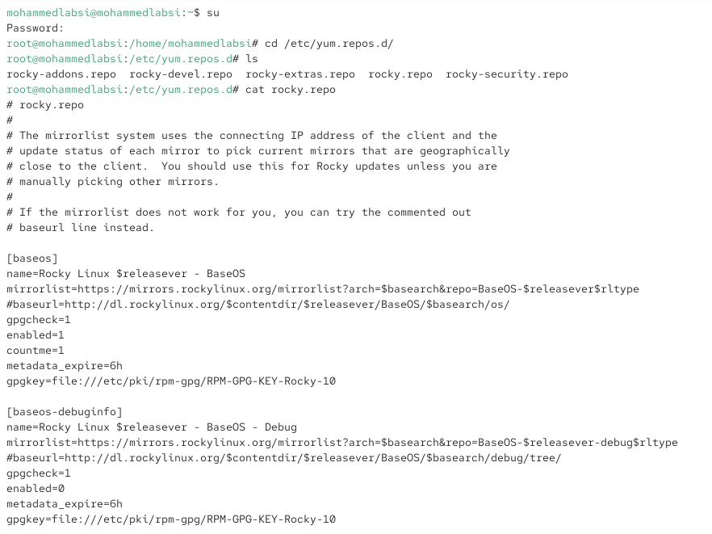{ #fig:001 width=70% height=70% }

## Проверяю подключённые репозитории

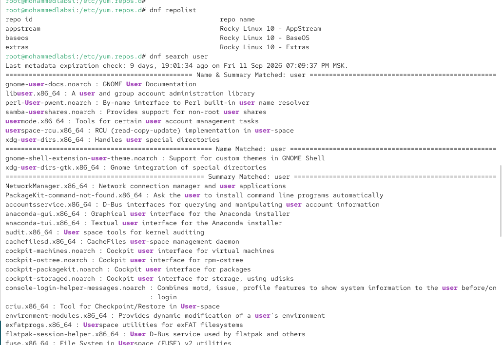{ #fig:002 width=70% height=70% }

## Изучаю информацию о пакете nmap

{ #fig:003 width=70% height=70% }

## Устанавливаю nmap через dnf

{ #fig:004 width=70% height=70% }

## Удаляю nmap

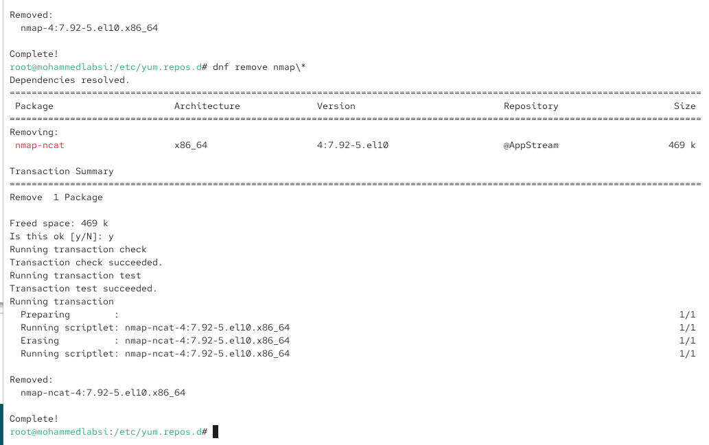{ #fig:005 width=70% height=70% }

## Просматриваю группы пакетов

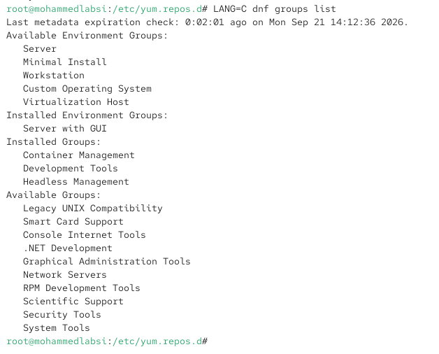{ #fig:006 width=70% height=70% }

## Устанавливаю RPM Development Tools

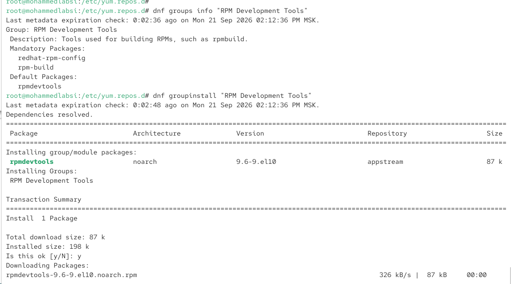{ #fig:007 width=70% height=70% }

## Изучаю историю dnf

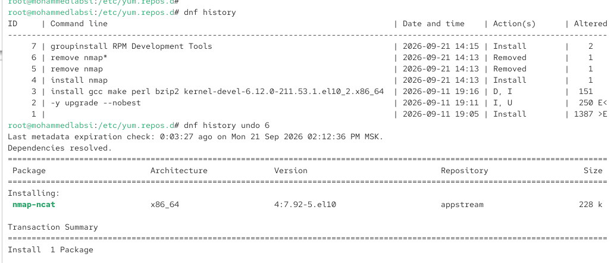{ #fig:008 width=70% height=70% }

## Загружаю пакет lynx

{ #fig:009 width=70% height=70% }

## Устанавливаю lynx через rpm

{ #fig:010 width=70% height=70% }

## Просматриваю файлы пакета lynx

{ #fig:011 width=70% height=70% }

## Просматриваю документацию lynx

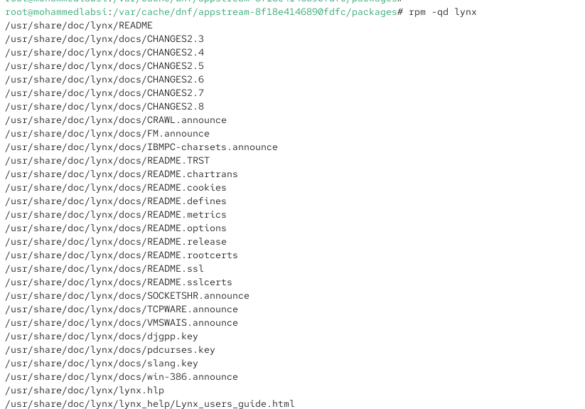{ #fig:012 width=70% height=70% }

## Изучаю справочную страницу lynx

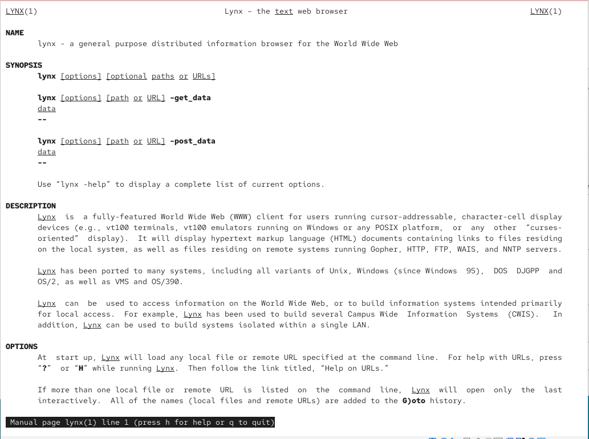{ #fig:013 width=70% height=70% }

## Проверяю запуск lynx

{ #fig:014 width=70% height=70% }

## Удаляю lynx

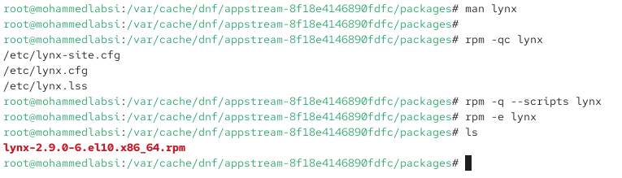{ #fig:015 width=70% height=70% }

## Проверяю пакет dnsmasq

{ #fig:016 width=70% height=70% }

## Получаю информацию о dnsmasq

{ #fig:017 width=70% height=70% }

## Просматриваю файлы dnsmasq

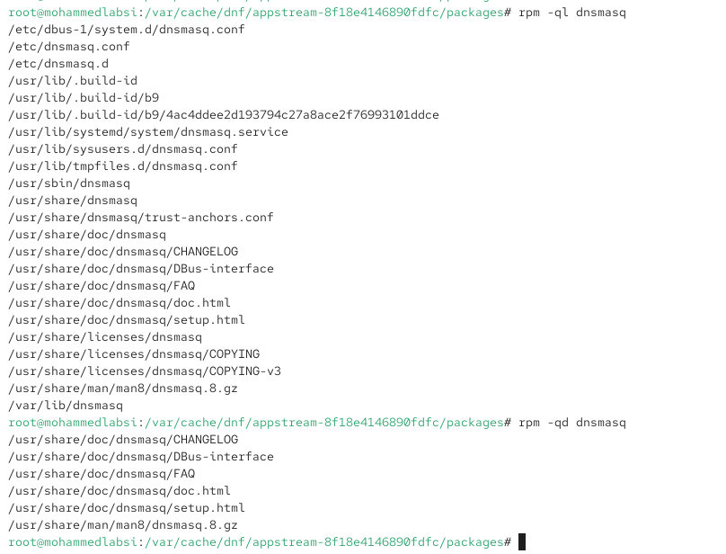{ #fig:018 width=70% height=70% }

## Изучаю справочную страницу dnsmasq

{ #fig:019 width=70% height=70% }

## Анализирую скрипты dnsmasq

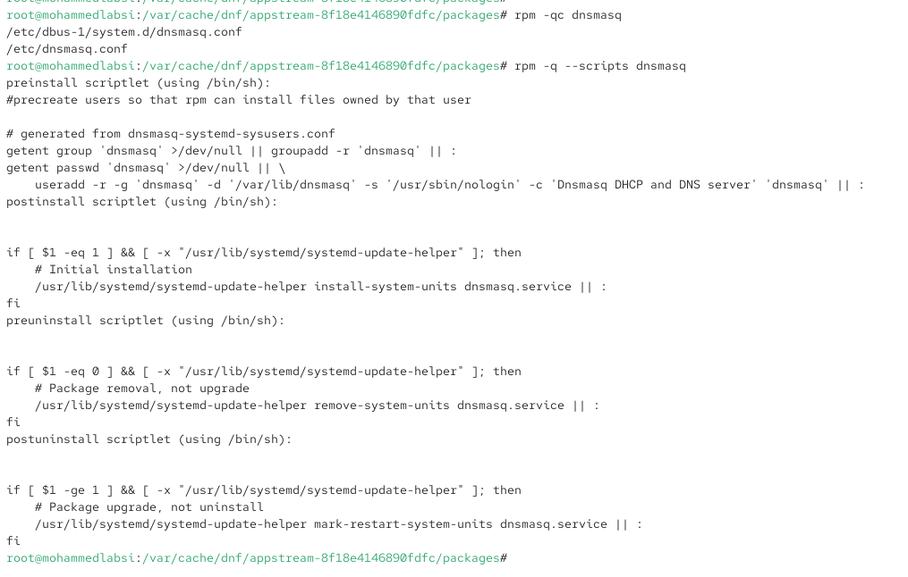{ #fig:020 width=70% height=70% }

# Выводы по проделанной работе

## Вывод

В ходе лабораторной работы были изучены репозитории Rocky Linux и файлы их настройки в каталоге `/etc/yum.repos.d`.

Были освоены основные возможности `dnf`: просмотр репозиториев, поиск, установка, удаление пакетов, работа с группами пакетов и просмотр истории транзакций.

Также была изучена работа с `rpm`: установка пакета из локального RPM-файла, просмотр информации о пакете, определение принадлежности файла пакету, просмотр документации, конфигурационных файлов и установочных скриптов.

На практике были рассмотрены пакеты `nmap`, `lynx` и `dnsmasq`.