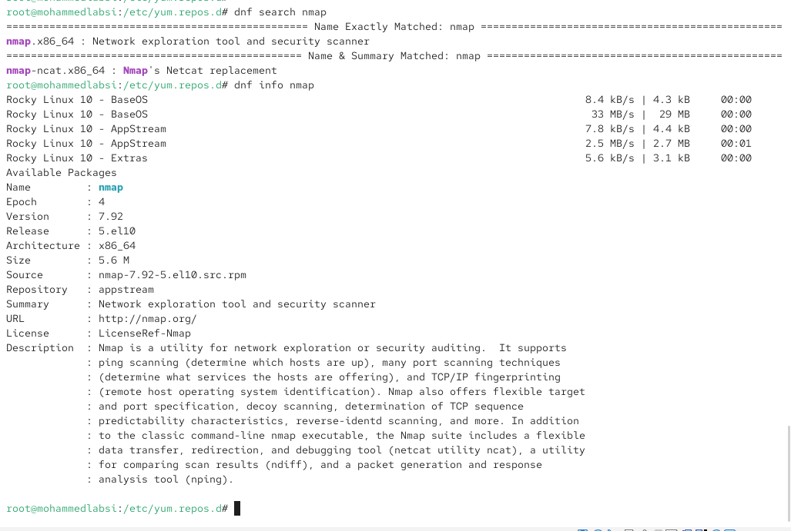
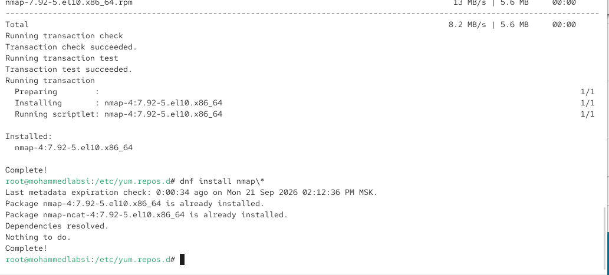
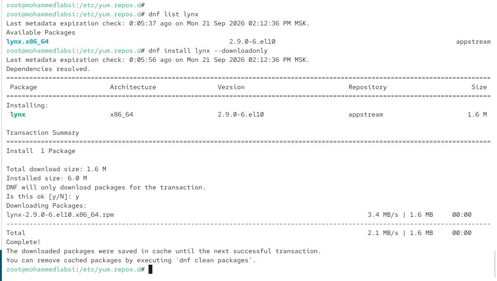
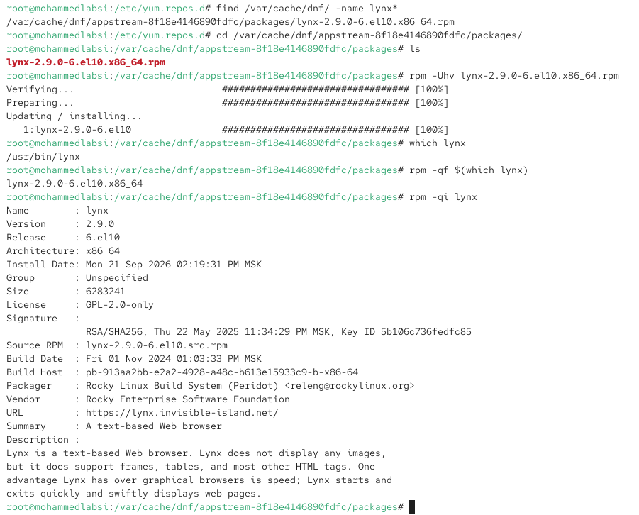
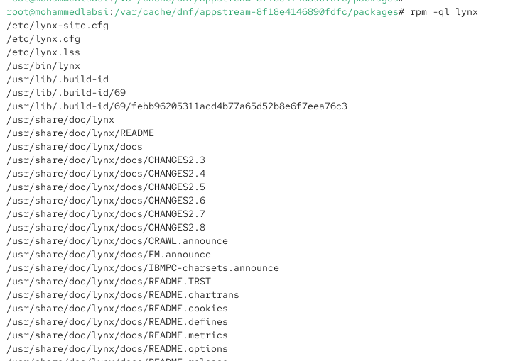
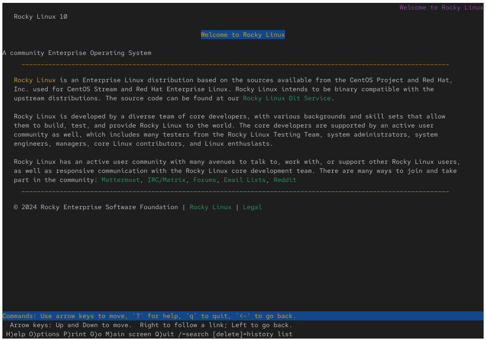
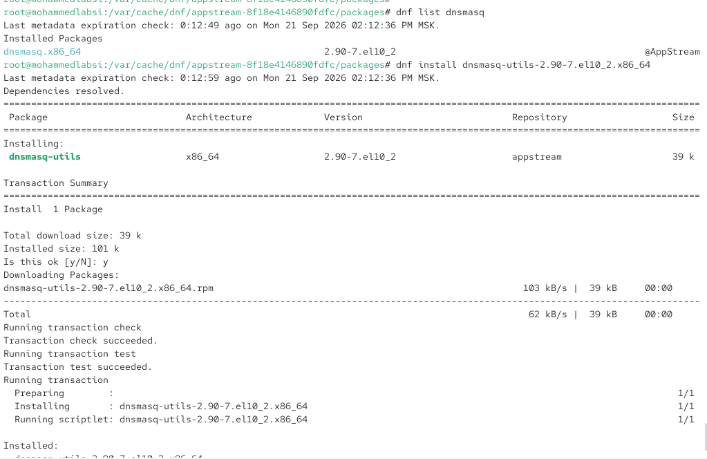
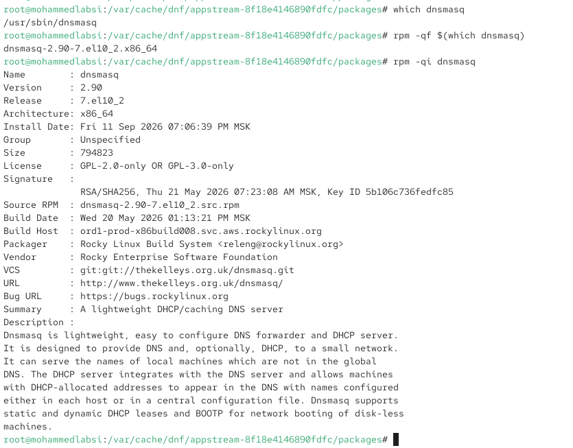
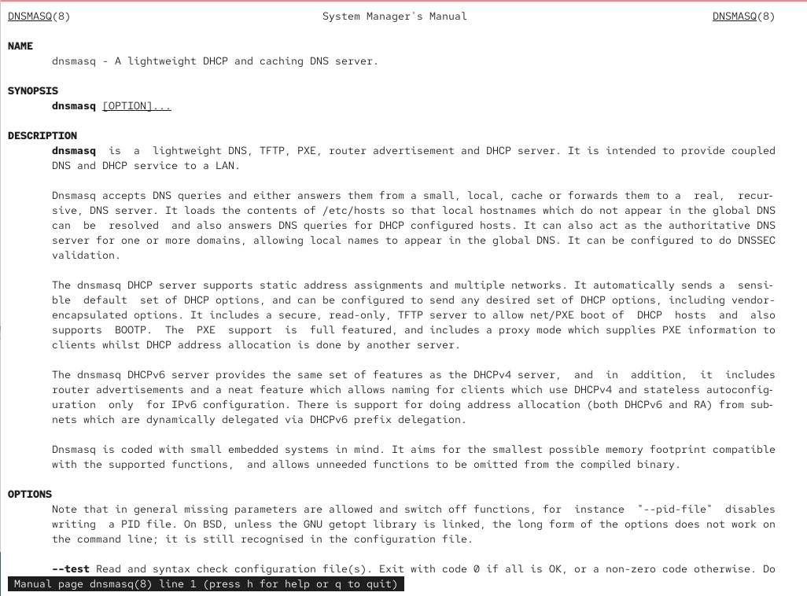

---
## Author
author:
  name: Лабси Мохаммед
  email: 1032245412@rudn.ru
  affiliation:
    - name: Российский университет дружбы народов
      country: Российская Федерация
      postal-code: 117198
      city: Москва
      address: ул. Миклухо-Маклая, д. 6

## Title
title: "Отчёт по лабораторной работе №4"
subtitle: "Работа с программными пакетами"
license: "CC BY"
---

# Цель работы

Получить навыки работы с репозиториями и менеджерами пакетов.

# Выполнение лабораторной работы

## Изучение репозиториев и основных возможностей DNF

Перехожу в режим работы суперпользователя. После успешной аутентификации перехожу в каталог, содержащий конфигурационные файлы репозиториев:

`su`

`cd /etc/yum.repos.d/`

Просматриваю содержимое каталога командой:

`ls`

В системе присутствуют файлы репозиториев `rocky-addons.repo`, `rocky-devel.repo`, `rocky-extras.repo`, `rocky.repo` и `rocky-security.repo`.

Для изучения структуры файла основного репозитория выполняю:

`cat rocky.repo`

Файлы с расширением `.repo` содержат описание источников программных пакетов. Каждый репозиторий задаётся отдельной секцией, например `[baseos]`. Параметр `name` содержит отображаемое имя репозитория, `mirrorlist` указывает адрес для получения списка доступных зеркал, а закомментированный параметр `baseurl` может использоваться для непосредственного указания адреса репозитория. Параметр `enabled=1` означает, что репозиторий включён, `gpgcheck=1` включает проверку цифровых подписей RPM-пакетов, а `gpgkey` задаёт расположение открытого ключа для проверки подписи. Параметр `metadata_expire` определяет срок актуальности локально сохранённых метаданных.

В файле также присутствуют дополнительные секции, например репозитории с отладочной информацией, которые могут быть отключены параметром `enabled=0` (см. рис. [@fig-001]).

{ #fig-001 width=70% }

Вывожу список подключённых и активных репозиториев:

`dnf repolist`

В результате отображаются идентификатор репозитория и его название. В системе активны репозитории `appstream`, `baseos` и `extras`, соответствующие AppStream, BaseOS и Extras дистрибутива Rocky Linux 10.

Репозиторий BaseOS содержит базовые компоненты операционной системы. AppStream используется для распространения дополнительных приложений, библиотек и программных компонентов, а Extras содержит дополнительные пакеты, не входящие в основную часть системы.

Для проверки возможностей поиска пакетов выполняю:

`dnf search user`

Команда ищет указанное слово не только в названиях пакетов, но и в их кратких описаниях. В результате вывод разделён на категории совпадений: точное совпадение в имени и описании, совпадение в имени и совпадение в кратком описании. Среди результатов присутствуют, например, `gnome-user-docs`, `libuser`, `usermode`, `userspace-rcu` и другие пакеты (см. рис. [@fig-002]).

{ #fig-002 width=70% }

Основные операции DNF выполняются следующими командами: `dnf search` используется для поиска пакетов, `dnf info` — для получения подробной информации, `dnf install` — для установки, `dnf remove` — для удаления, а `dnf upgrade` или `dnf update` — для обновления установленных пакетов. Историю выполненных транзакций можно просматривать с помощью `dnf history`.

## Установка и удаление nmap с использованием DNF

Выполняю поиск пакетов, связанных с программой `nmap`:

`dnf search nmap`

В результатах присутствуют основной пакет `nmap.x86_64`, содержащий средство исследования сети и сканирования безопасности, а также пакет `nmap-ncat.x86_64`, содержащий реализацию Netcat из состава Nmap.

Получаю подробные сведения об основном пакете:

`dnf info nmap`

В системе доступен пакет `nmap` версии `7.92` с выпуском `5.el10` для архитектуры `x86_64`. Пакет расположен в репозитории `appstream`. В описании указано, что Nmap предназначен для исследования сети и аудита безопасности, поддерживает определение доступных узлов, сканирование портов, определение сервисов и операционных систем и другие функции анализа сети (см. рис. [@fig-003]).

{ #fig-003 width=70% }

Устанавливаю основной пакет:

`dnf install nmap`

DNF выполняет разрешение зависимостей, проверку транзакции и установку пакета. В системе устанавливается `nmap-4:7.92-5.el10.x86_64`.

После этого выполняю:

`dnf install nmap\*`

Обратная косая черта перед символом `*` необходима для того, чтобы оболочка не раскрывала шаблон самостоятельно, а передала его непосредственно DNF.

Команда `dnf install nmap` выбирает пакет с конкретным именем `nmap` и необходимые для него зависимости. Команда `dnf install nmap\*` обрабатывает `nmap*` как шаблон имени и выбирает все подходящие пакеты, названия которых начинаются с `nmap`. В данном случае к ним относятся `nmap` и `nmap-ncat`. Поскольку оба пакета к этому моменту уже присутствуют в системе, DNF сообщает `Nothing to do` (см. рис. [@fig-004]).

{ #fig-004 width=70% }

Для удаления пакетов сначала выполняю:

`dnf remove nmap`

Команда удаляет непосредственно основной пакет `nmap`.

Затем выполняю:

`dnf remove nmap\*`

По шаблону находится оставшийся пакет `nmap-ncat`. DNF показывает сводку транзакции, запрашивает подтверждение и после ответа `y` удаляет пакет. В результате освобождается занятое им дисковое пространство (см. рис. [@fig-005]).

{ #fig-005 width=70% }

## Работа с группами пакетов DNF

Для просмотра групп пакетов используется команда:

`dnf groups list`

Чтобы получить названия групп на английском языке независимо от текущей локали системы, выполняю:

`LANG=C dnf groups list`

В выводе представлены доступные группы окружений и обычные группы пакетов. Среди доступных групп присутствует `RPM Development Tools`, которая предназначена для установки инструментов разработки и сборки RPM-пакетов (см. рис. [@fig-006]).

{ #fig-006 width=70% }

Получаю подробную информацию о группе:

`dnf groups info "RPM Development Tools"`

В описании указано, что группа содержит инструменты для создания RPM-пакетов. К обязательным пакетам относятся `redhat-rpm-config` и `rpm-build`, а к устанавливаемым по умолчанию — `rpmdevtools`.

Устанавливаю группу:

`dnf groupinstall "RPM Development Tools"`

DNF определяет уже имеющиеся компоненты группы и устанавливает недостающие. На данном компьютере для завершения установки группы требуется добавить пакет `rpmdevtools` версии `9.6-9.el10` из репозитория `appstream` (см. рис. [@fig-007]).

Для удаления установленной группы при необходимости используется команда:

`dnf groupremove "RPM Development Tools"`

{ #fig-007 width=70% }

## Просмотр и отмена операций DNF

Просматриваю журнал выполненных транзакций:

`dnf history`

В таблице отображаются идентификатор операции, введённая командная строка, дата и время выполнения, выполненное действие и количество затронутых пакетов. В истории видны операции установки `nmap`, удаления `nmap`, удаления пакетов по шаблону `nmap*`, а также установка группы `RPM Development Tools`.

Для проверки возможности отмены транзакции выполняю:

`dnf history undo 6`

Транзакция с идентификатором `6` соответствовала удалению пакета по команде `remove nmap*`. DNF определяет действия, необходимые для отмены этой операции, и предлагает вновь установить удалённый пакет `nmap-ncat`. Следовательно, `dnf history undo` позволяет выполнить обратную транзакцию для выбранного действия из истории (см. рис. [@fig-008]).

{ #fig-008 width=70% }

## Установка пакета lynx с использованием RPM

Для изучения возможностей RPM устанавливаю текстовый браузер `lynx`. Сначала проверяю наличие пакета в репозиториях:

`dnf list lynx`

DNF показывает доступный пакет `lynx.x86_64` версии `2.9.0-6.el10` из репозитория `appstream`.

Загружаю RPM-пакет без его установки:

`dnf install lynx --downloadonly`

Параметр `--downloadonly` заставляет DNF скачать необходимые файлы, но не выполнять установочную транзакцию. Загружается файл `lynx-2.9.0-6.el10.x86_64.rpm` размером около 1,6 МБ. DNF сообщает, что загруженные пакеты сохраняются в кэше (см. рис. [@fig-009]).

{ #fig-009 width=70% }

Нахожу загруженный RPM-файл:

`find /var/cache/dnf/ -name lynx\*`

Файл находится в каталоге кэша репозитория AppStream. Перехожу в найденный каталог и проверяю его содержимое:

`cd /var/cache/dnf/appstream-8f18e4146890fdfc/packages/`

`ls`

В каталоге присутствует файл:

`lynx-2.9.0-6.el10.x86_64.rpm`

Устанавливаю пакет непосредственно средствами RPM:

`rpm -Uhv lynx-2.9.0-6.el10.x86_64.rpm`

Параметр `-U` выполняет установку нового пакета или обновление уже существующего, `-h` отображает процесс выполнения в виде символов `#`, а `-v` включает подробный режим вывода. Проверка и установка завершаются успешно.

Определяю путь к исполняемому файлу:

`which lynx`

Получаю:

`/usr/bin/lynx`

По имени исполняемого файла определяю пакет, которому он принадлежит:

`rpm -qf $(which lynx)`

Результат:

`lynx-2.9.0-6.el10.x86_64`

Команда `rpm -qf` определяет пакет-владелец указанного файла.

Получаю подробную информацию об установленном пакете:

`rpm -qi lynx`

Вывод содержит имя, версию, выпуск, архитектуру, дату установки, размер, лицензию, сведения о разработчике и описание. Lynx представляет собой текстовый веб-браузер, предназначенный для работы в терминале (см. рис. [@fig-010]).

{ #fig-010 width=70% }

Для получения полного перечня файлов установленного пакета выполняю:

`rpm -ql lynx`

Команда выводит конфигурационные файлы, исполняемый файл `/usr/bin/lynx`, служебные файлы, документацию и другие объекты, установленные вместе с пакетом (см. рис. [@fig-011]).

{ #fig-011 width=70% }

Отдельно получаю список файлов, помеченных в пакете как документация:

`rpm -qd lynx`

В выводе присутствуют файл `README`, история изменений различных версий, дополнительные документы и руководство пользователя. Документация размещена преимущественно в каталоге `/usr/share/doc/lynx` (см. рис. [@fig-012]).

{ #fig-012 width=70% }

Просматриваю справочную страницу программы:

`man lynx`

В руководстве описывается назначение Lynx, синтаксис запуска, доступные параметры и особенности использования. Lynx является клиентом для просмотра WWW-ресурсов в символьном терминале и способен открывать локальные файлы и удалённые URL (см. рис. [@fig-013]).

{ #fig-013 width=70% }

Для проверки корректности установки запускаю текстовый браузер `lynx`. Программа успешно открывается и отображает стартовую страницу Rocky Linux в текстовом режиме. Навигация осуществляется с клавиатуры: клавиши со стрелками используются для перемещения и перехода по ссылкам, `q` — для выхода, а `?` — для вызова справки. Успешный запуск подтверждает работоспособность установленного пакета (см. рис. [@fig-014]).

{ #fig-014 width=70% }

Возвращаюсь в терминал с правами суперпользователя и просматриваю конфигурационные файлы пакета:

`rpm -qc lynx`

Команда показывает:

`/etc/lynx-site.cfg`

`/etc/lynx.cfg`

`/etc/lynx.lss`

Далее проверяю наличие скриптов RPM:

`rpm -q --scripts lynx`

Для пакета `lynx` команда не выводит дополнительных сценариев, следовательно, отдельных RPM scriptlets для выполнения при установке или удалении в данном пакете нет.

Удаляю установленный пакет:

`rpm -e lynx`

Команда `rpm -e` удаляет указанный установленный пакет. После удаления выполняю:

`ls`

RPM-файл `lynx-2.9.0-6.el10.x86_64.rpm` остаётся в каталоге кэша, поскольку удаление установленного пакета не означает удаление исходного RPM-файла с диска (см. рис. [@fig-015]).

{ #fig-015 width=70% }

## Исследование пакета dnsmasq с использованием RPM

Перехожу к исследованию пакета `dnsmasq`, реализующего лёгкий DNS- и DHCP-сервер.

Проверяю состояние пакета:

`dnf list dnsmasq`

В выводе пакет `dnsmasq.x86_64` версии `2.90-7.el10_2` отмечен как установленный из репозитория AppStream. Следовательно, основной пакет `dnsmasq` уже присутствует в системе.

Дополнительно устанавливаю пакет утилит соответствующей версии:

`dnf install dnsmasq-utils-2.90-7.el10_2.x86_64`

DNF разрешает зависимости и устанавливает пакет `dnsmasq-utils`. Он содержит дополнительные средства, связанные с использованием `dnsmasq` (см. рис. [@fig-016]).

{ #fig-016 width=70% }

Определяю расположение исполняемого файла:

`which dnsmasq`

Получаю:

`/usr/sbin/dnsmasq`

Определяю пакет, которому принадлежит этот файл:

`rpm -qf $(which dnsmasq)`

Результат:

`dnsmasq-2.90-7.el10_2.x86_64`

Получаю подробные сведения о пакете:

`rpm -qi dnsmasq`

Пакет имеет версию `2.90`, выпуск `7.el10_2` и архитектуру `x86_64`. В описании указано, что `dnsmasq` представляет собой лёгкий DNS-forwarder и DHCP-сервер. Он предназначен для небольших сетей, способен обслуживать локальные DNS-имена, выдавать адреса по DHCP и поддерживает дополнительные сетевые функции (см. рис. [@fig-017]).

{ #fig-017 width=70% }

Получаю полный список файлов пакета:

`rpm -ql dnsmasq`

В него входят конфигурационные файлы, файл исполняемой программы `/usr/sbin/dnsmasq`, unit-файл systemd `dnsmasq.service`, системные файлы и документация.

Получаю перечень документации:

`rpm -qd dnsmasq`

В выводе присутствуют `CHANGELOG`, `DBus-interface`, `FAQ`, HTML-документация и страница руководства `/usr/share/man/man8/dnsmasq.8.gz` (см. рис. [@fig-018]).

{ #fig-018 width=70% }

Открываю руководство:

`man dnsmasq`

Справочная страница описывает `dnsmasq` как лёгкий DNS-, TFTP-, PXE-, DHCP-сервер и компонент router advertisement. Программа предназначена прежде всего для предоставления DNS- и DHCP-сервисов в локальных сетях. Она может отвечать на DNS-запросы из локального кэша либо перенаправлять их внешним DNS-серверам, а DHCP-сервер поддерживает статическую и динамическую выдачу адресов (см. рис. [@fig-019]).

{ #fig-019 width=70% }

Получаю список конфигурационных файлов:

`rpm -qc dnsmasq`

В пакете присутствуют:

`/etc/dbus-1/system.d/dnsmasq.conf`

`/etc/dnsmasq.conf`

Файл `/etc/dnsmasq.conf` является основным конфигурационным файлом службы.

Просматриваю RPM-скрипты пакета:

`rpm -q --scripts dnsmasq`

В отличие от `lynx`, пакет `dnsmasq` содержит несколько служебных сценариев.

Сценарий `preinstall` выполняется перед установкой. Он проверяет наличие системной группы `dnsmasq`, при необходимости создаёт её командой `groupadd -r`, а затем проверяет наличие системного пользователя `dnsmasq` и при необходимости создаёт его. Для пользователя задаётся домашний каталог `/var/lib/dnsmasq`, оболочка `/usr/sbin/nologin` и описание `Dnsmasq DHCP and DNS server`.

Сценарий `postinstall` выполняется после установки пакета и использует `systemd-update-helper` для регистрации `dnsmasq.service` в systemd при первоначальной установке.

Сценарий `preuninstall` предназначен для действий непосредственно перед удалением. При полном удалении пакета он вызывает `systemd-update-helper remove-system-units dnsmasq.service`, чтобы корректно обработать системную службу.

Сценарий `postuninstall` используется, в частности, при обновлении пакета и позволяет отметить службу `dnsmasq.service` для перезапуска после замены файлов. Эти скрипты обеспечивают корректную интеграцию RPM-пакета с системными пользователями и менеджером служб systemd (см. рис. [@fig-020]).

{ #fig-020 width=70% }

Для удаления основного пакета средствами RPM используется команда:

`rpm -e dnsmasq`

Команда удаляет установленный пакет `dnsmasq`. В задании имя пакета в команде удаления приведено как `dnsmask`, однако фактическое имя установленного пакета — `dnsmasq`, поэтому при удалении необходимо использовать именно `dnsmasq`.

## Контрольные вопросы

1. **Какая команда позволяет вам искать пакет rpm, содержащий файл useradd?**  
   Для поиска пакета, в состав которого входит определённый файл, можно использовать команду **dnf provides**.  
   Например: **dnf provides \*/useradd**.  
   Команда выполнит поиск по подключённым репозиториям и покажет RPM-пакет, содержащий файл **useradd**. В Rocky Linux данный файл входит в пакет **shadow-utils**.

2. **Какие команды вам нужно использовать, чтобы показать имя группы dnf, которая содержит инструменты безопасности и показывает, что находится в этой группе?**  
   Сначала необходимо вывести список доступных групп пакетов: **dnf groups list**.  
   При необходимости для отображения названий на английском языке можно использовать: **LANG=C dnf groups list**.  
   После определения нужной группы её содержимое можно посмотреть командой: **dnf groups info "Security Tools"**.  
   Первая команда позволяет найти название группы, связанной с инструментами безопасности, а вторая выводит описание группы и перечень входящих в неё пакетов.

3. **Какая команда позволяет вам установить rpm, который вы загрузили из Интернета и который не находится в репозиториях?**  
   Локальный RPM-пакет можно установить с помощью команды **dnf install ./имя_пакета.rpm**.  
   Например: **dnf install ./package.rpm**.  
   В этом случае DNF устанавливает пакет из локального файла и при необходимости пытается получить его зависимости из подключённых репозиториев. Также для непосредственной установки средствами RPM можно использовать команду **rpm -Uvh package.rpm**.

4. **Вы хотите убедиться, что пакет rpm, который вы загрузили, не содержит никакого опасного кода сценария. Какая команда позволяет это сделать?**  
   Для просмотра сценариев, находящихся внутри RPM-файла до его установки, используется команда **rpm -qp --scripts имя_пакета.rpm**.  
   Например: **rpm -qp --scripts package.rpm**.  
   Параметр **-q** включает режим запроса, **-p** указывает, что анализируется RPM-файл, а **--scripts** выводит сценарии установки, удаления и обновления пакета. Это позволяет заранее проверить команды, которые пакет может выполнить в системе.

5. **Какая команда показывает всю документацию в rpm?**  
   Для установленного пакета список файлов документации можно получить командой **rpm -qd имя_пакета**.  
   Например: **rpm -qd lynx**.  
   Команда выводит файлы, которые в RPM-пакете отмечены как документация, включая руководства, README и другие справочные материалы. Для ещё не установленного RPM-файла можно использовать команду **rpm -qpd имя_пакета.rpm**.

6. **Какая команда показывает, какому пакету rpm принадлежит файл?**  
   Для определения пакета-владельца файла используется команда **rpm -qf путь_к_файлу**.  
   Например: **rpm -qf /usr/bin/lynx**.  
   Если путь к исполняемому файлу заранее неизвестен, команды можно объединить: **rpm -qf $(which lynx)**.  
   В результате RPM выведет имя, версию и выпуск пакета, которому принадлежит указанный файл.

# Заключение

В ходе лабораторной работы изучена организация программных репозиториев Rocky Linux. Конфигурация репозиториев хранится в файлах с расширением `.repo` в каталоге `/etc/yum.repos.d/`. Рассмотрены параметры подключения репозиториев, проверки цифровых подписей и использования зеркал.

Освоены основные возможности менеджера пакетов DNF: просмотр репозиториев, поиск пакетов, получение информации о них, установка, удаление и обновление программного обеспечения, работа с группами пакетов и журналом транзакций. На примере `nmap` изучена разница между указанием точного имени пакета и использованием шаблона имени. Также выполнена установка группы `RPM Development Tools` и рассмотрена возможность отмены ранее выполненных транзакций с помощью `dnf history undo`.

На примере текстового браузера `lynx` изучена установка программ непосредственно из RPM-файла. С помощью `rpm` определены принадлежность исполняемого файла пакету, сведения о пакете, полный список установленных файлов, документация, конфигурационные файлы и RPM-скрипты. Работоспособность Lynx проверена непосредственным запуском программы.

На примере `dnsmasq` дополнительно изучено содержимое RPM-пакета и назначение сценариев `preinstall`, `postinstall`, `preuninstall` и `postuninstall`. Установлено, что RPM-скрипты могут использоваться для создания системных пользователей и групп, регистрации служб systemd и выполнения необходимых действий при установке, обновлении и удалении программного обеспечения.
