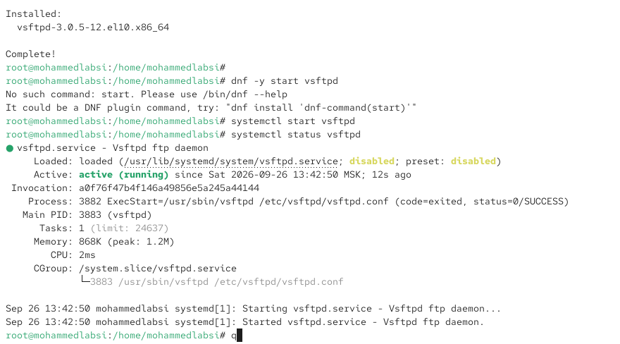
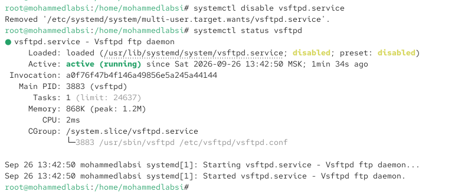
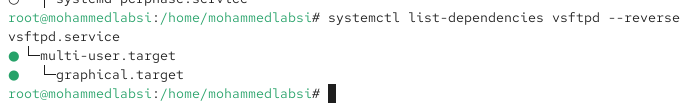
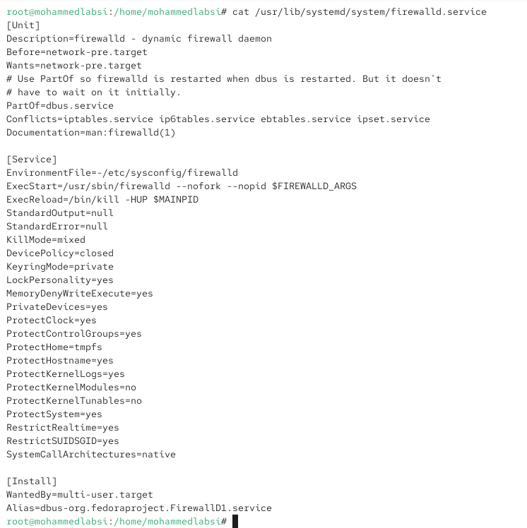
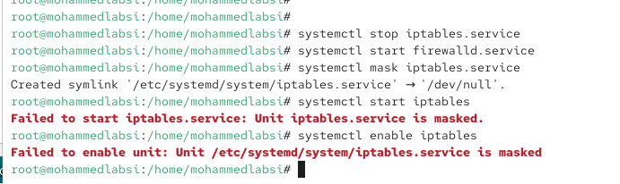
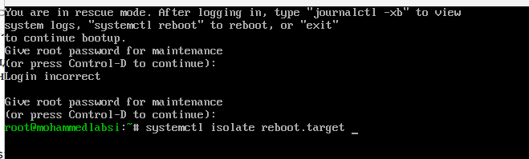
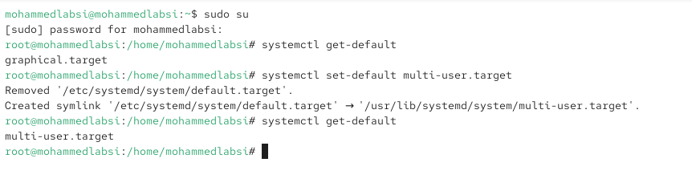
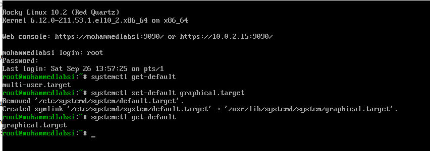

---
## Author
author:
  name: Лабси Мохаммед
  email: 1032245412@rudn.ru
  affiliation:
    - name: Российский университет дружбы народов
      country: Российская Федерация
      postal-code: 117198
      city: Москва
      address: ул. Миклухо-Маклая, д. 6

## Title
title: Лабораторная работа №5
subtitle: Управление системными службами
license: CC BY
date: today
date-format: "YYYY-MM-DD"
---

# Цели и задачи работы

## Цель лабораторной работы

Получить практические навыки управления системными службами в Linux с использованием `systemd`.

Изучить запуск и остановку сервисов, управление автозагрузкой, зависимости и конфликты юнитов, а также работу с целями `systemd`.

# Процесс выполнения лабораторной работы

## Запускаю службу vsftpd

{ #fig:001 width=70% height=70% }

## Добавляю vsftpd в автозапуск

{ #fig:002 width=70% height=70% }

## Удаляю vsftpd из автозапуска

{ #fig:003 width=70% height=70% }

## Проверяю автозапуск vsftpd

{ #fig:004 width=70% height=70% }

## Изучаю зависимости vsftpd

{ #fig:005 width=70% height=70% }

## Изучаю обратные зависимости vsftpd

{ #fig:006 width=70% height=70% }

# Конфликты системных служб

## Проверяю firewalld и iptables

{ #fig:007 width=70% height=70% }

## Демонстрирую конфликт служб

{ #fig:008 width=70% height=70% }

## Изучаю юнит firewalld

{ #fig:009 width=70% height=70% }

## Изучаю юнит iptables

{ #fig:010 width=70% height=70% }

## Блокирую запуск iptables

{ #fig:011 width=70% height=70% }

# Работа с целями systemd

## Нахожу изолируемые цели

{ #fig:012 width=70% height=70% }

## Перехожу в режим восстановления

{ #fig:013 width=70% height=70% }

# Настройка цели по умолчанию

## Устанавливаю текстовый режим загрузки

{ #fig:014 width=70% height=70% }

## Возвращаю графический режим загрузки

{ #fig:015 width=70% height=70% }

# Выводы по проделанной работе

## Вывод

В ходе лабораторной работы были изучены основные возможности системы инициализации `systemd` и команды `systemctl` для управления системными службами.

На примере `vsftpd` были освоены запуск службы, проверка её состояния, добавление и удаление из автозагрузки, а также просмотр прямых и обратных зависимостей юнита.

На примере `firewalld` и `iptables` был изучен механизм конфликтов между юнитами. Рассмотрена директива `Conflicts` и выполнено маскирование службы `iptables` с помощью `systemctl mask`.

Также была изучена работа с изолируемыми целями `systemd`. Выполнен переход в `rescue.target` и рассмотрена перезагрузка через `reboot.target`.

В завершение была выполнена настройка цели загрузки системы по умолчанию с переключением между `multi-user.target` и `graphical.target`.