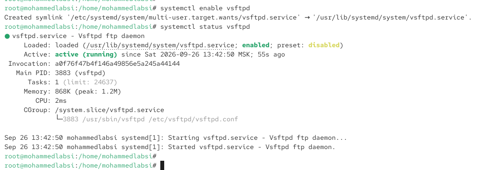
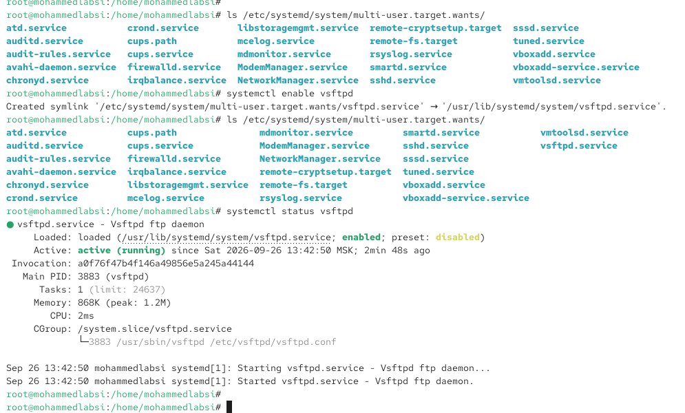
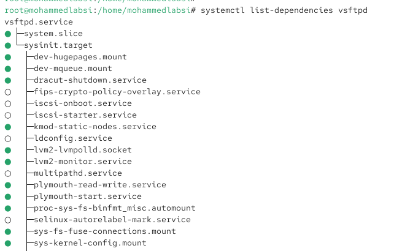
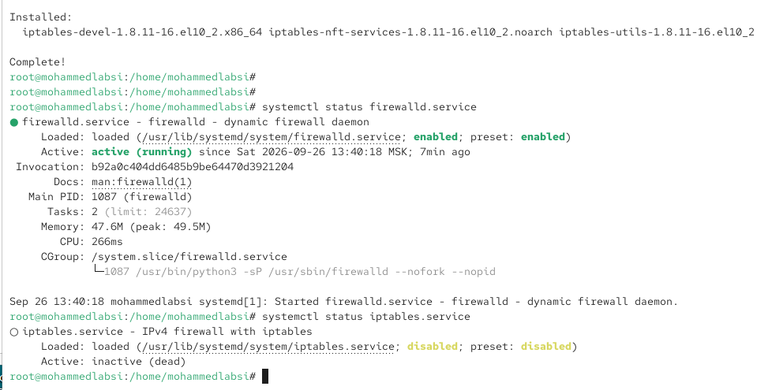
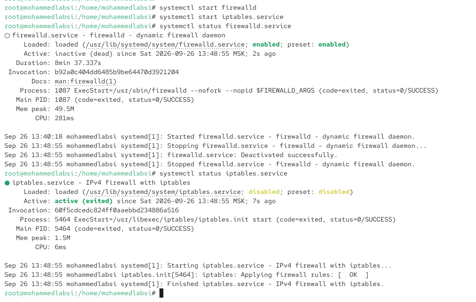
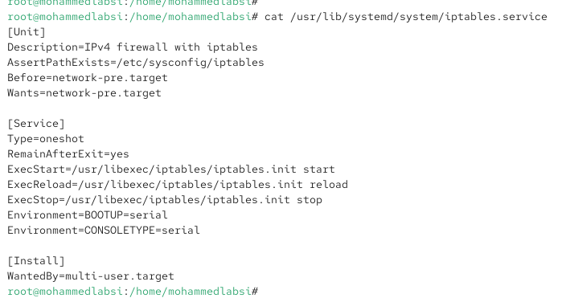
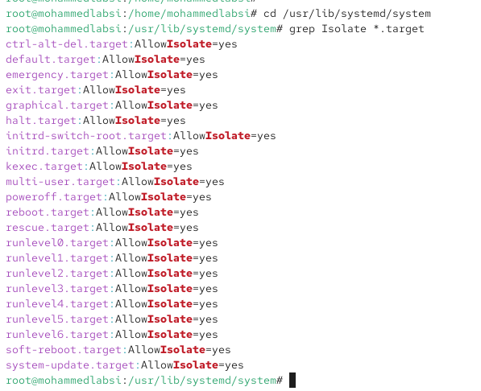

---
## Author
author:
  name: Лабси Мохаммед
  email: 1032245412@rudn.ru
  affiliation:
    - name: Российский университет дружбы народов
      country: Российская Федерация
      postal-code: 117198
      city: Москва
      address: ул. Миклухо-Маклая, д. 6

## Title
title: "Отчёт по лабораторной работе №5"
subtitle: "Управление системными службами"
license: "CC BY"
---

# Цель работы

Получить навыки управления системными службами операционной системы посредством systemd.

# Выполнение лабораторной работы

## Управление службой Very Secure FTP

Получаю полномочия администратора и устанавливаю службу Very Secure FTP с помощью пакетного менеджера DNF:

`dnf -y install vsftpd`

После установки пакет `vsftpd-3.0.5-12.el10.x86_64` успешно добавлен в систему.

Для запуска службы первоначально была введена команда:

`dnf -y start vsftpd`

DNF сообщает, что команды `start` не существует, поскольку запуск и остановка системных служб выполняются не средствами пакетного менеджера, а с помощью `systemctl`. Поэтому запускаю службу корректной командой:

`systemctl start vsftpd`

После запуска проверяю её состояние:

`systemctl status vsftpd`

Служба `vsftpd.service` находится в состоянии `active (running)`, то есть FTP-сервер запущен и работает. При этом параметр `Loaded` показывает состояние `disabled`, следовательно, служба пока не добавлена в автоматический запуск при загрузке операционной системы (см. рис. [@fig-001]).

{ #fig-001 width=70% }

Добавляю службу `vsftpd` в автозапуск:

`systemctl enable vsftpd`

В результате создаётся символическая ссылка:

`/etc/systemd/system/multi-user.target.wants/vsftpd.service -> /usr/lib/systemd/system/vsftpd.service`

Повторно проверяю состояние:

`systemctl status vsftpd`

Теперь в строке `Loaded` отображается состояние `enabled`, а сама служба продолжает находиться в состоянии `active (running)`. Это означает, что `vsftpd` работает в текущем сеансе и будет автоматически запускаться при последующих загрузках системы (см. рис. [@fig-002]).

{ #fig-002 width=70% }

Для удаления службы из автозапуска выполняю:

`systemctl disable vsftpd.service`

После выполнения команды созданная ранее символическая ссылка удаляется. Проверяю состояние службы:

`systemctl status vsftpd`

Параметр `Loaded` снова принимает значение `disabled`. При этом состояние остаётся `active (running)`, поскольку команда `disable` не останавливает уже запущенную службу, а только исключает её автоматический запуск при последующей загрузке операционной системы (см. рис. [@fig-003]).

{ #fig-003 width=70% }

Проверяю содержимое каталога символических ссылок для цели `multi-user.target`:

`ls /etc/systemd/system/multi-user.target.wants/`

После выполнения `disable` ссылка `vsftpd.service` в каталоге отсутствует.

Снова добавляю службу в автозапуск:

`systemctl enable vsftpd`

Повторно просматриваю содержимое каталога:

`ls /etc/systemd/system/multi-user.target.wants/`

В списке появляется `vsftpd.service`, что подтверждает создание ссылки, отвечающей за автоматический запуск службы при переходе системы к цели `multi-user.target`.

Для дополнительной проверки выполняю:

`systemctl status vsftpd`

Состояние загрузки юнита изменилось на `enabled`, а состояние самой службы остаётся `active (running)` (см. рис. [@fig-004]).

{ #fig-004 width=70% }

Для просмотра зависимостей службы выполняю:

`systemctl list-dependencies vsftpd`

Команда формирует иерархический список юнитов, от которых зависит `vsftpd.service`. Среди них присутствуют `system.slice`, `sysinit.target`, различные файловые системы, сокеты, системные службы и другие компоненты, необходимые для работы сервиса. Зелёными маркерами обозначены активные зависимости, а пустыми — неактивные на момент выполнения команды (см. рис. [@fig-005]).

{ #fig-005 width=70% }

Для просмотра обратных зависимостей, то есть юнитов, зависящих от `vsftpd`, использую:

`systemctl list-dependencies vsftpd --reverse`

В результате видно, что `vsftpd.service` связан с `multi-user.target`, которая, в свою очередь, входит в зависимости `graphical.target`. Следовательно, при обычной многопользовательской или графической загрузке системы включённая служба может быть запущена как часть соответствующей цели (см. рис. [@fig-006]).

{ #fig-006 width=70% }

## Разрешение конфликтов между firewalld и iptables

Для выполнения задания устанавливаю пакеты `iptables`, включая необходимые дополнительные компоненты:

`dnf -y install iptables\*`

После завершения установки проверяю состояние `firewalld`:

`systemctl status firewalld.service`

Служба `firewalld.service` находится в состоянии `active (running)` и имеет состояние загрузки `enabled`.

Затем проверяю `iptables`:

`systemctl status iptables.service`

Служба `iptables.service` имеет состояние загрузки `disabled` и в данный момент находится в состоянии `inactive (dead)` (см. рис. [@fig-007]).

{ #fig-007 width=70% }

Для демонстрации конфликта пытаюсь последовательно запустить обе службы:

`systemctl start firewalld`

`systemctl start iptables.service`

После запуска `iptables` снова проверяю состояние `firewalld`:

`systemctl status firewalld.service`

Служба `firewalld` была автоматически остановлена и перешла в состояние `inactive (dead)`.

Проверяю состояние `iptables`:

`systemctl status iptables.service`

Для `iptables.service` отображается состояние `active (exited)`. Такое состояние связано с типом юнита `oneshot`: команда настройки правил выполняется и завершается, после чего systemd считает юнит активным благодаря параметру `RemainAfterExit=yes`.

Таким образом, одновременно использовать `firewalld` и классическую службу `iptables` нельзя: при запуске конфликтующего юнита ранее активная служба `firewalld` деактивируется (см. рис. [@fig-008]).

{ #fig-008 width=70% }

Для определения причины конфликта просматриваю файл юнита `firewalld`:

`cat /usr/lib/systemd/system/firewalld.service`

В секции `[Unit]` присутствует строка:

`Conflicts=iptables.service ip6tables.service ebtables.service ipset.service`

Директива `Conflicts` указывает systemd, что `firewalld.service` не должен работать одновременно с перечисленными юнитами. В данном случае к ним относятся `iptables.service`, `ip6tables.service`, `ebtables.service` и `ipset.service`.

Также в конфигурации присутствуют параметры `Before=network-pre.target` и `Wants=network-pre.target`, определяющие связь службы с ранним этапом настройки сети. В секции `[Install]` указано `WantedBy=multi-user.target`, что позволяет подключать службу к стандартной многопользовательской цели системы (см. рис. [@fig-009]).

{ #fig-009 width=70% }

Просматриваю файл юнита `iptables`:

`cat /usr/lib/systemd/system/iptables.service`

В секции `[Unit]` присутствуют параметры:

`Wants=network-pre.target`

`Before=network-pre.target`

Явной директивы `Conflicts=firewalld.service` в данном файле нет. Следовательно, взаимное исключение обеспечивается директивой `Conflicts` со стороны юнита `firewalld.service`.

В секции `[Service]` установлен параметр:

`Type=oneshot`

Команда запуска задаётся директивой:

`ExecStart=/usr/libexec/iptables/iptables.init start`

Также присутствует:

`RemainAfterExit=yes`

Поэтому после выполнения скрипта настройки правил процесс завершается, однако юнит продолжает считаться активным. Команды `ExecReload` и `ExecStop` используются соответственно для перезагрузки и остановки правил `iptables` (см. рис. [@fig-010]).

{ #fig-010 width=70% }

Для предотвращения случайного запуска `iptables` сначала останавливаю эту службу и запускаю `firewalld`:

`systemctl stop iptables.service`

`systemctl start firewalld.service`

Затем блокирую возможность запуска `iptables`:

`systemctl mask iptables.service`

Команда создаёт символическую ссылку:

`/etc/systemd/system/iptables.service -> /dev/null`

Файл юнита в каталоге `/etc/systemd/system` имеет более высокий приоритет, чем файл из `/usr/lib/systemd/system`, поэтому обращение юнита к `/dev/null` полностью блокирует его запуск.

Проверяю действие маскирования попыткой запуска:

`systemctl start iptables`

В результате systemd возвращает ошибку:

`Failed to start iptables.service: Unit iptables.service is masked.`

Дополнительно пытаюсь добавить службу в автозапуск:

`systemctl enable iptables`

Операция также завершается ошибкой, поскольку замаскированный юнит не может быть включён:

`Failed to enable unit: Unit /etc/systemd/system/iptables.service is masked`

Следовательно, маскирование является более строгим механизмом блокировки, чем `disable`: отключённый юнит можно запустить вручную, тогда как замаскированный юнит нельзя ни запустить обычным способом, ни добавить в автозапуск до снятия маски (см. рис. [@fig-011]).

{ #fig-011 width=70% }

## Работа с изолируемыми целями systemd

Перехожу в каталог, содержащий системные unit-файлы:

`cd /usr/lib/systemd/system`

Для поиска целей, допускающих изоляцию, выполняю:

`grep Isolate *.target`

В результате отображаются target-юниты, в которых присутствует параметр:

`AllowIsolate=yes`

Среди найденных целей находятся `graphical.target`, `multi-user.target`, `rescue.target`, `poweroff.target`, `reboot.target`, `emergency.target` и ряд других.

Параметр `AllowIsolate=yes` означает, что к данной цели разрешено переключиться с помощью команды `systemctl isolate`. При изоляции systemd запускает зависимости выбранной цели и останавливает юниты, которые для неё не требуются (см. рис. [@fig-012]).

{ #fig-012 width=70% }

Для перехода в режим восстановления выполняю:

`systemctl isolate rescue.target`

После переключения система переходит в `rescue mode` и запрашивает пароль пользователя `root` для выполнения административных операций. После успешной аутентификации появляется консоль суперпользователя.

Для перезагрузки системы через изолируемую цель выполняю:

`systemctl isolate reboot.target`

Команда переключает систему на цель `reboot.target`, предназначенную для завершения текущего сеанса работы и перезапуска операционной системы (см. рис. [@fig-013]).

{ #fig-013 width=70% }

## Настройка цели systemd по умолчанию

После получения полномочий администратора определяю цель, используемую системой по умолчанию:

`systemctl get-default`

Первоначально результатом является:

`graphical.target`

Следовательно, система настроена на загрузку графического режима.

Для изменения режима загрузки устанавливаю в качестве цели по умолчанию `multi-user.target`:

`systemctl set-default multi-user.target`

При выполнении команды удаляется прежняя ссылка `/etc/systemd/system/default.target` и создаётся новая:

`/etc/systemd/system/default.target -> /usr/lib/systemd/system/multi-user.target`

Проверяю результат:

`systemctl get-default`

Команда выводит:

`multi-user.target`

Следовательно, при следующей загрузке система должна перейти в многопользовательский текстовый режим без запуска графической среды (см. рис. [@fig-014]).

{ #fig-014 width=70% }

После перезагрузки операционная система действительно загружается в текстовом режиме. На экране отображается консоль входа Rocky Linux, после чего выполняю вход под учётной записью `root`.

Проверяю текущую цель по умолчанию:

`systemctl get-default`

Результат:

`multi-user.target`

Это подтверждает применение выполненной ранее настройки.

Для возврата к загрузке графического режима выполняю:

`systemctl set-default graphical.target`

При этом ссылка `/etc/systemd/system/default.target` перенаправляется на:

`/usr/lib/systemd/system/graphical.target`

Повторно выполняю:

`systemctl get-default`

В результате отображается:

`graphical.target`

Следовательно, в качестве цели загрузки по умолчанию снова установлен графический режим (см. рис. [@fig-015]).

{ #fig-015 width=70% }

## Контрольные вопросы

1. **Что такое юнит (unit)? Приведите примеры.**  
   **Юнит (unit)** — это объект, которым управляет система инициализации **systemd**. Юнит описывается специальным unit-файлом и может представлять службу, цель, устройство, точку монтирования, сокет и другие системные объекты.  
   Тип юнита определяется расширением его файла. Например, **vsftpd.service** и **firewalld.service** являются сервисными юнитами, **multi-user.target** и **graphical.target** — целевыми юнитами, **home.mount** — юнитом точки монтирования, а файлы с расширением **.socket** представляют сокеты.  
   Управление юнитами осуществляется преимущественно с помощью команды **systemctl**.

2. **Какая команда позволяет вам убедиться, что цель больше не входит в список автоматического запуска при загрузке системы?**  
   Для проверки состояния автоматического запуска юнита можно использовать команду **systemctl is-enabled**.  
   Например: **systemctl is-enabled имя.target**.  
   Если цель исключена из автоматического запуска, команда выведет состояние **disabled**. Для цели загрузки системы по умолчанию дополнительно используется команда **systemctl get-default**, которая показывает, какая цель в настоящий момент установлена как цель по умолчанию.

3. **Какую команду вы должны использовать для отображения всех сервисных юнитов, которые в настоящее время загружены?**  
   Для отображения сервисных юнитов используется команда **systemctl list-units --type=service**.  
   Она выводит сервисные юниты, загруженные системой systemd, и показывает их состояние.  
   Если необходимо включить в вывод также неактивные загруженные сервисные юниты, можно выполнить: **systemctl list-units --type=service --all**.

4. **Как создать потребность (wants) в сервисе?**  
   Зависимость типа **Wants** можно создать командой **systemctl add-wants**.  
   Например: **systemctl add-wants multi-user.target vsftpd.service**.  
   В результате для указанной цели создаётся зависимость от сервиса. Фактически systemd создаёт соответствующую символическую ссылку в каталоге **multi-user.target.wants**.  
   При обычном добавлении сервиса в автозапуск также часто используется команда **systemctl enable имя.service**, которая создаёт ссылки в соответствии с параметром **WantedBy** секции **[Install]** unit-файла.

5. **Как переключить текущее состояние на цель восстановления (rescue target)?**  
   Для перехода системы в режим восстановления необходимо выполнить команду **systemctl isolate rescue.target**.  
   Systemd активирует **rescue.target** и её зависимости, одновременно останавливая юниты, которые для режима восстановления не требуются. После перехода в этот режим система может запросить пароль пользователя **root** для выполнения административных операций.

6. **Поясните причину получения сообщения о том, что цель не может быть изолирована.**  
   Не каждая цель systemd разрешает выполнение операции **isolate**. Чтобы цель могла быть изолирована, в её unit-файле должен присутствовать параметр **AllowIsolate=yes**.  
   Если этого параметра нет либо для него установлено значение **no**, команда **systemctl isolate имя.target** завершится ошибкой, сообщающей, что операция изоляции для данной цели запрещена.  
   Найти цели, поддерживающие изоляцию, можно, например, командой **grep Isolate /usr/lib/systemd/system/\*.target**.

7. **Вы хотите отключить службу systemd, но, прежде чем сделать это, вы хотите узнать, какие другие юниты зависят от этой службы. Какую команду вы бы использовали?**  
   Для просмотра юнитов, которые зависят от выбранной службы, используется команда **systemctl list-dependencies имя.service --reverse**.  
   Например: **systemctl list-dependencies vsftpd.service --reverse**.  
   Параметр **--reverse** изменяет направление просмотра зависимостей и показывает не те юниты, от которых зависит указанный сервис, а те юниты, которые сами зависят от него. Это позволяет оценить возможные последствия отключения службы.

# Заключение

В ходе лабораторной работы изучены основные возможности системы инициализации `systemd` и способы управления системными службами в Rocky Linux. Рассмотрены операции запуска, остановки, проверки состояния и настройки автоматического запуска сервисов с помощью команды `systemctl`.

На примере службы `vsftpd` освоена установка сервиса, его запуск, добавление в автозагрузку и удаление из неё. Рассмотрено создание символических ссылок в каталоге `/etc/systemd/system/multi-user.target.wants/`, а также изучены прямые и обратные зависимости юнитов с помощью команд `systemctl list-dependencies` и `systemctl list-dependencies --reverse`.

На примере служб `firewalld` и `iptables` изучен механизм конфликтов между юнитами systemd. Рассмотрена директива `Conflicts` в unit-файле `firewalld.service` и проверено поведение системы при попытке одновременного запуска конфликтующих служб. Дополнительно освоено маскирование юнита с помощью `systemctl mask`, при котором создаётся символическая ссылка на `/dev/null`, полностью запрещающая запуск и добавление службы в автозагрузку.

Также изучены цели systemd и механизм их изоляции. С помощью параметра `AllowIsolate=yes` определены цели, которые допускают переключение командой `systemctl isolate`. Выполнен переход системы в режим восстановления `rescue.target` и рассмотрена перезагрузка через цель `reboot.target`.

В завершение изучена настройка цели загрузки системы по умолчанию. С помощью команд `systemctl get-default` и `systemctl set-default` выполнено переключение между `multi-user.target` и `graphical.target`. Проверена загрузка системы как в текстовом, так и в графическом режиме.