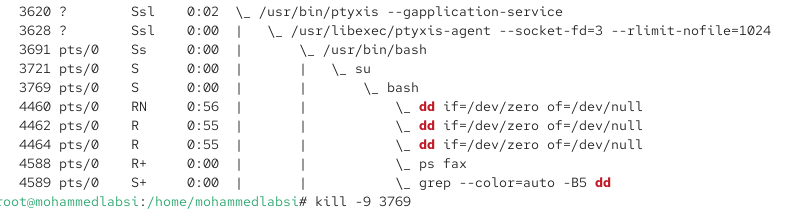
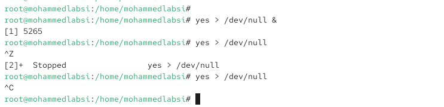
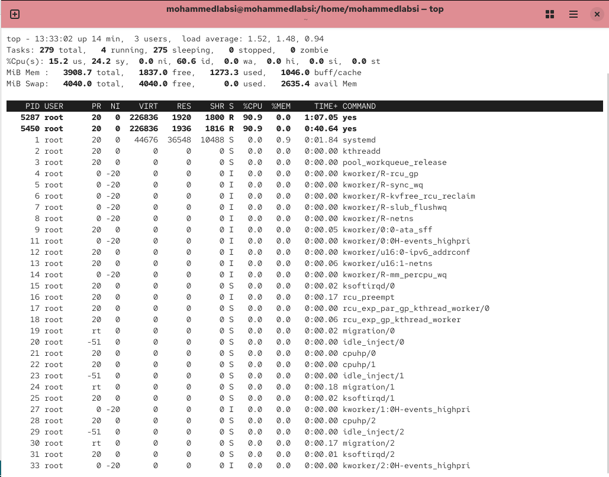
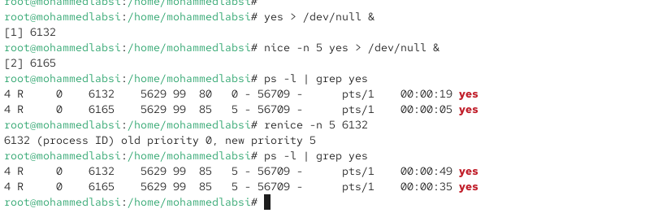

---
## Author
author:
  name: Лабси Мохаммед
  email: 1032245412@rudn.ru
  affiliation:
    - name: Российский университет дружбы народов
      country: Российская Федерация
      postal-code: 117198
      city: Москва
      address: ул. Миклухо-Маклая, д. 6

## Title
title: Лабораторная работа №6
subtitle: Управление процессами
license: CC BY
date: today
date-format: "YYYY-MM-DD"
---

# Цели и задачи работы

## Цель лабораторной работы

Получить практические навыки управления заданиями и процессами в Linux.

Изучить запуск процессов в фоновом и переднем режимах, приостановку и продолжение заданий, завершение процессов, работу с сигналами, а также изменение приоритетов с помощью `nice` и `renice`.

# Управление заданиями

## Запускаю задания в фоновом режиме

{ #fig:001 width=70% height=70% }

## Проверяю процесс dd в top

{ #fig:002 width=70% height=70% }

## Завершаю процесс dd через top

{ #fig:003 width=70% height=70% }

# Управление процессами

## Запускаю процессы dd и изменяю приоритет

{ #fig:004 width=70% height=70% }

## Изучаю иерархию процессов

{ #fig:005 width=70% height=70% }

# Самостоятельная работа

## Изменяю значение nice у процесса dd

{ #fig:006 width=70% height=70% }

## Запускаю программу yes

{ #fig:007 width=70% height=70% }

## Управляю заданиями yes

{ #fig:008 width=70% height=70% }

## Проверяю процессы yes в top

{ #fig:009 width=70% height=70% }

## Завершаю процессы yes

{ #fig:010 width=70% height=70% }

## Сравниваю приоритеты процессов yes

{ #fig:011 width=70% height=70% }

# Выводы по проделанной работе

## Вывод

В ходе лабораторной работы были изучены основные средства управления заданиями и процессами в Linux.

Были освоены команды `jobs`, `bg`, `fg`, `ps`, `top`, `kill`, `killall`, `nice` и `renice`.

На практике были рассмотрены запуск процессов в фоновом и переднем режимах, приостановка заданий с помощью `Ctrl+Z`, завершение процессов с помощью `Ctrl+C`, отправка сигналов и управление процессами по PID.

Также была изучена работа утилиты `nohup`, позволяющей процессу продолжать выполнение после закрытия терминала.

В завершение были рассмотрены механизмы изменения приоритета процессов. Установлено, что увеличение значения `nice` уменьшает приоритет процесса, а уменьшение значения `nice` повышает его приоритет.