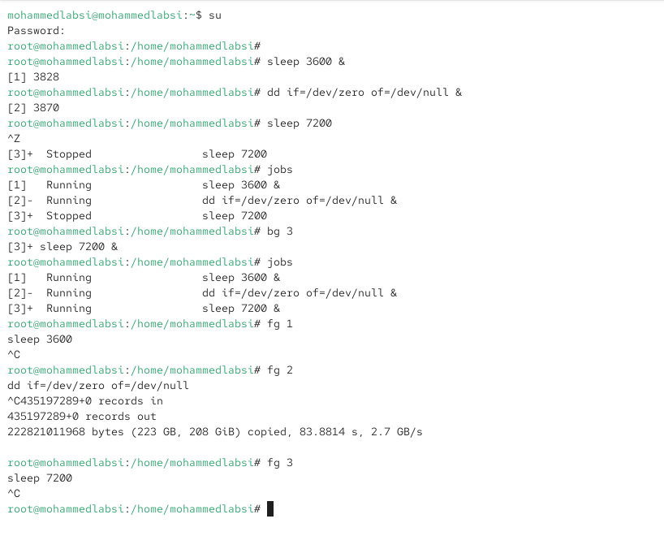
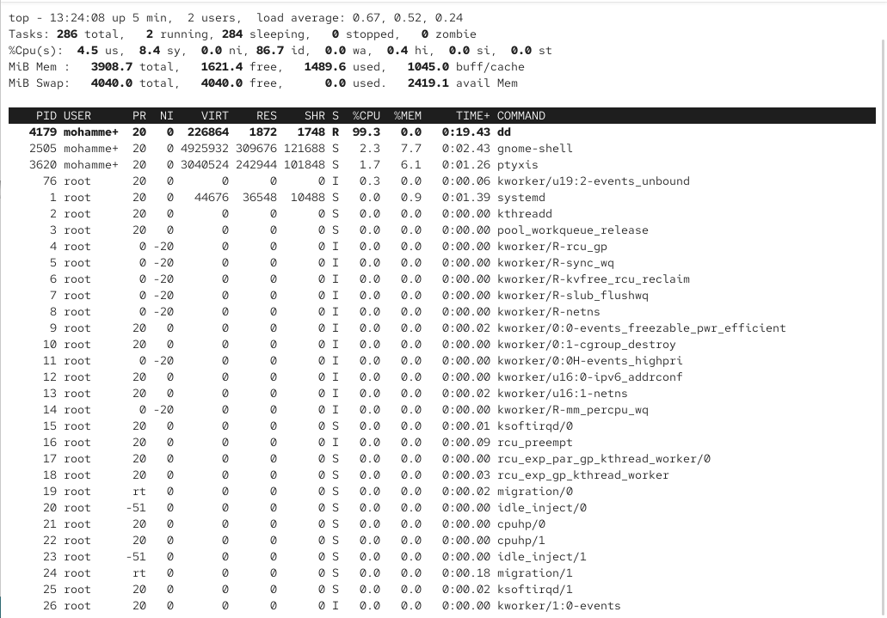
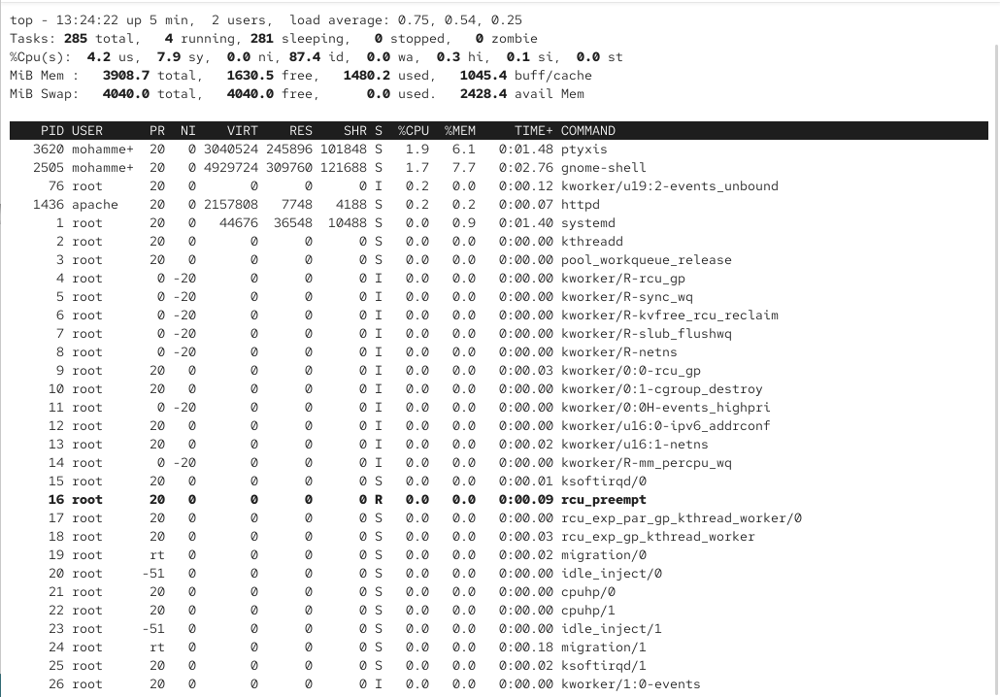
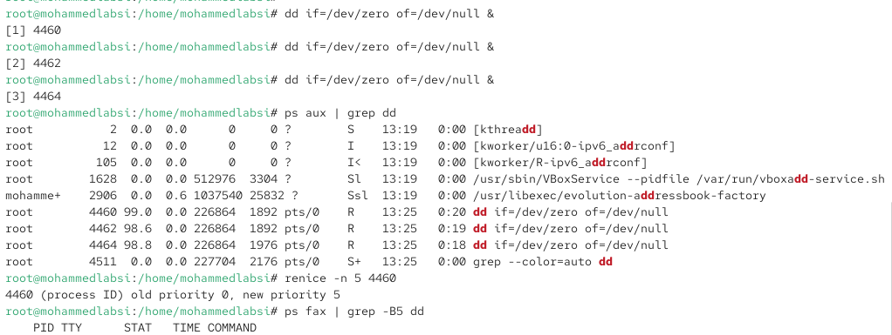
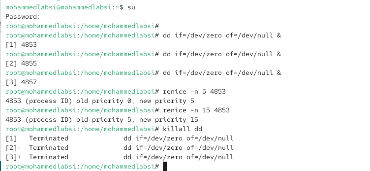
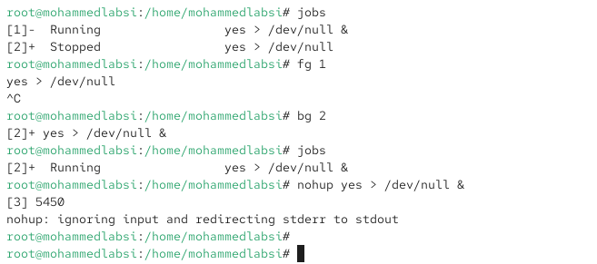
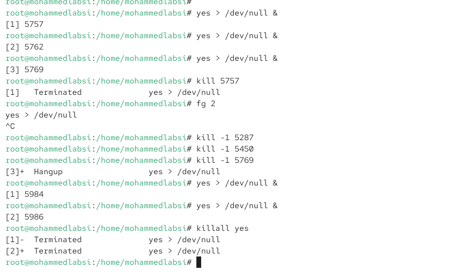

---
## Author
author:
  name: Лабси Мохаммед
  email: 1032245412@rudn.ru
  affiliation:
    - name: Российский университет дружбы народов
      country: Российская Федерация
      postal-code: 117198
      city: Москва
      address: ул. Миклухо-Маклая, д. 6

## Title
title: "Отчёт по лабораторной работе №6"
subtitle: "Управление процессами"
license: "CC BY"
---

# Цель работы

Получить навыки управления процессами операционной системы.

# Выполнение лабораторной работы

## 6.4. Управление процессами и заданиями

### 6.4.1. Управление заданиями

Получаю полномочия администратора:

`su -`

После успешной аутентификации запускаю два процесса в фоновом режиме:

`sleep 3600 &`

`dd if=/dev/zero of=/dev/null &`

Знак `&` в конце команды приводит к запуску процесса в фоновом режиме, поэтому оболочка сразу возвращает приглашение для ввода следующей команды.

Затем запускаю ещё один процесс:

`sleep 7200`

Последняя команда запущена без символа `&`, поэтому процесс выполняется на переднем плане и блокирует ввод команд в оболочке. Для временной приостановки процесса использую сочетание клавиш `Ctrl+Z`.

После этого проверяю список заданий:

`jobs`

В списке отображаются три задания. Процессы `sleep 3600` и `dd if=/dev/zero of=/dev/null` имеют состояние `Running`, а процесс `sleep 7200`, остановленный сочетанием `Ctrl+Z`, имеет состояние `Stopped`.

Для продолжения выполнения третьего задания в фоновом режиме выполняю:

`bg 3`

Повторно проверяю состояние заданий:

`jobs`

После выполнения команды `bg 3` процесс `sleep 7200` переходит из состояния `Stopped` в состояние `Running` и продолжает работу в фоне.

Далее переношу первое задание на передний план:

`fg 1`

После перехода процесса `sleep 3600` на передний план завершаю его сочетанием клавиш `Ctrl+C`.

Аналогично перевожу на передний план второе задание:

`fg 2`

Процесс `dd` начинает выполняться на переднем плане. Завершаю его сочетанием `Ctrl+C`. После завершения `dd` выводится статистика обработанных данных.

Затем переношу на передний план третье задание:

`fg 3`

Процесс `sleep 7200` также завершаю сочетанием клавиш `Ctrl+C`.

В результате все три созданных задания прекращают работу (см. рис. [@fig-001]).

{ #fig-001 width=70% }

Далее открываю второй терминал и под учётной записью обычного пользователя запускаю процесс `dd` в фоновом режиме:

`dd if=/dev/zero of=/dev/null &`

После запуска фонового процесса завершаю оболочку второго терминала командой:

`exit`

В другом терминале запускаю утилиту мониторинга процессов:

`top`

В списке процессов присутствует процесс `dd` с PID `4179`, запущенный пользователем. В момент проверки он использует около `99,3 %` процессорного времени, что подтверждает его активную работу после закрытия терминала, из которого он был запущен (см. рис. [@fig-002]).

{ #fig-002 width=70% }

Для завершения процесса повторно использую:

`top`

В интерфейсе `top` нажимаю клавишу `k`, указываю PID процесса `4179` и подтверждаю отправку сигнала завершения.

После этого процесс `dd` исчезает из списка наиболее активных процессов. В верхней части списка больше нет процесса с PID `4179`, использовавшего почти всё доступное процессорное время (см. рис. [@fig-003]).

{ #fig-003 width=70% }

### 6.4.2. Управление процессами

Получаю полномочия администратора:

`su -`

Запускаю три экземпляра программы `dd` в фоновом режиме:

`dd if=/dev/zero of=/dev/null &`

`dd if=/dev/zero of=/dev/null &`

`dd if=/dev/zero of=/dev/null &`

Созданным процессам присваиваются PID `4460`, `4462` и `4464`.

Для поиска процессов выполняю:

`ps aux | grep dd`

Команда `ps aux` выводит список процессов системы, а `grep dd` оставляет строки, содержащие последовательность `dd`. Помимо системных процессов, в названиях которых встречается эта последовательность, в конце списка отображаются три запущенных процесса:

`dd if=/dev/zero of=/dev/null`

Для процесса с PID `4460` изменяю значение `nice`:

`renice -n 5 4460`

Утилита сообщает:

`4460 (process ID) old priority 0, new priority 5`

Следовательно, значение `nice` процесса было изменено с `0` на `5`. Увеличение значения `nice` уменьшает приоритет процесса при распределении процессорного времени (см. рис. [@fig-004]).

{ #fig-004 width=70% }

Для просмотра иерархии процессов выполняю:

`ps fax | grep -B5 dd`

Параметр `f` команды `ps` отображает процессы в виде дерева, а параметр `-B5` программы `grep` дополнительно показывает пять строк, расположенных перед найденными совпадениями.

В полученном дереве видно, что три процесса `dd` с PID `4460`, `4462` и `4464` были запущены из оболочки `bash` с PID `3769`. Выше в дереве также отображается процесс `su` с PID `3721` и исходная пользовательская оболочка.

Для завершения корневой оболочки отправляю процессу с PID `3769` сигнал `SIGKILL`:

`kill -9 3769`

После выполнения команды корневая оболочка завершается. Команда демонстрирует возможность управления процессами через их PID и работу с иерархией родительских и дочерних процессов (см. рис. [@fig-005]).

{ #fig-005 width=70% }

## 6.5. Самостоятельная работа

### 6.5.1. Задание 1

Получаю полномочия администратора:

`su -`

Запускаю три процесса `dd` в фоновом режиме:

`dd if=/dev/zero of=/dev/null &`

`dd if=/dev/zero of=/dev/null &`

`dd if=/dev/zero of=/dev/null &`

Процессам присваиваются PID `4853`, `4855` и `4857`.

Для первого процесса изменяю значение `nice`:

`renice -n 5 4853`

Получаю результат:

`4853 (process ID) old priority 0, new priority 5`

После этого ещё раз изменяю значение `nice` того же процесса:

`renice -n 15 4853`

Система сообщает:

`4853 (process ID) old priority 5, new priority 15`

На выполненном скриншоте использованы положительные значения `5` и `15`. При увеличении `nice` с `5` до `15` процесс получает меньший приоритет при планировании процессорного времени.

По условию задания требовалось использовать значения `-5` и `-15`. Для выполнения именно этого условия команды должны иметь вид:

`renice -n -5 4853`

`renice -n -15 4853`

При переходе от `-5` к `-15` приоритет процесса, напротив, увеличивается: чем меньше значение `nice`, тем выше предпочтение процесса при распределении процессорного времени. Установка отрицательных значений `nice` требует соответствующих административных полномочий.

Для одновременного завершения всех запущенных процессов `dd` выполняю:

`killall dd`

После выполнения команды оболочка сообщает о завершении заданий `[1]`, `[2]` и `[3]` (см. рис. [@fig-006]).

{ #fig-006 width=70% }

### 6.5.2. Задание 2

Запускаю программу `yes` в фоновом режиме, перенаправляя стандартный поток вывода в `/dev/null`:

`yes > /dev/null &`

Процесс запускается как фоновое задание `[1]` с PID `5265`. Перенаправление в `/dev/null` необходимо, поскольку программа `yes` непрерывно выводит строки и без перенаправления быстро заполняет терминал.

Затем запускаю аналогичный процесс на переднем плане:

`yes > /dev/null`

Приостанавливаю его сочетанием клавиш `Ctrl+Z`. Оболочка сообщает, что задание `[2]` получило состояние `Stopped`.

Повторно запускаю:

`yes > /dev/null`

и завершаю процесс сочетанием клавиш `Ctrl+C`.

При запуске `yes` без подавления потока вывода используется команда:

`yes`

В этом случае программа непрерывно выводит символ `y` в терминал. Её также можно приостановить сочетанием `Ctrl+Z`, а после повторного запуска завершить сочетанием `Ctrl+C` (см. рис. [@fig-007]).

{ #fig-007 width=70% }

Проверяю состояние заданий:

`jobs`

В списке видно, что задание `[1]` находится в состоянии `Running`, а задание `[2]` — в состоянии `Stopped`.

Перевожу первое фоновое задание на передний план:

`fg 1`

После появления процесса на переднем плане завершаю его сочетанием клавиш `Ctrl+C`.

Затем возобновляю выполнение второго остановленного задания в фоне:

`bg 2`

Проверяю состояние:

`jobs`

Теперь задание `[2]` имеет состояние `Running` и выполняется в фоновом режиме.

Для запуска процесса, который должен быть защищён от сигнала `SIGHUP` при завершении терминального сеанса, использую `nohup`:

`nohup yes > /dev/null &`

Создаётся задание `[3]` с PID `5450`. Утилита `nohup` сообщает об игнорировании стандартного ввода и перенаправлении стандартного потока ошибок. Процесс получает возможность продолжить работу после закрытия терминальной сессии (см. рис. [@fig-008]).

{ #fig-008 width=70% }

После закрытия окна терминала и повторного запуска консоли проверяю работающие процессы при помощи:

`top`

В верхней части списка отображаются процессы `yes`. В частности, присутствует процесс с PID `5450`, ранее запущенный через `nohup`. Он продолжает выполняться и активно использует процессорное время.

Также в списке присутствует процесс `yes` с PID `5287`. Оба процесса в момент наблюдения используют приблизительно по `90,9 %` процессорного времени (см. рис. [@fig-009]).

{ #fig-009 width=70% }

Далее запускаю ещё три процесса `yes` в фоновом режиме с подавлением вывода:

`yes > /dev/null &`

`yes > /dev/null &`

`yes > /dev/null &`

Им присваиваются PID `5757`, `5762` и `5769`.

Первый процесс завершаю по его PID:

`kill 5757`

Оболочка сообщает о завершении задания `[1]`.

Для работы со вторым процессом использую идентификатор задания:

`fg 2`

После перевода задания `[2]` на передний план завершаю его сочетанием клавиш `Ctrl+C`.

Далее проверяю действие сигнала `SIGHUP`, номер которого равен `1`. Отправляю его обычному процессу:

`kill -1 5287`

После этого отправляю `SIGHUP` процессу с PID `5450`, который был запущен через `nohup`:

`kill -1 5450`

Процесс, запущенный через `nohup`, предназначен для игнорирования сигнала `SIGHUP`, поэтому он должен продолжить выполнение после получения этого сигнала.

Также отправляю сигнал `SIGHUP` обычному процессу с PID `5769`:

`kill -1 5769`

Для него оболочка выводит сообщение:

`Hangup`

Это показывает, что обычный процесс завершился при получении `SIGHUP`, в отличие от процесса, защищённого с помощью `nohup`.

После этого запускаю ещё несколько экземпляров `yes`:

`yes > /dev/null &`

`yes > /dev/null &`

Создаются процессы с PID `5984` и `5986`.

Для их одновременного завершения использую команду:

`killall yes`

Команда завершает процессы программы `yes`, а оболочка сообщает о завершении фоновых заданий (см. рис. [@fig-010]).

{ #fig-010 width=70% }

Для сравнения приоритетов запускаю обычный процесс `yes`:

`yes > /dev/null &`

Он получает PID `6132`.

Затем с помощью утилиты `nice` запускаю второй процесс с увеличенным на `5` значением `nice`:

`nice -n 5 yes > /dev/null &`

Второй процесс получает PID `6165`.

Для сравнения параметров процессов выполняю:

`ps -l | grep yes`

Для процесса с PID `6132` отображается значение `NI`, равное `0`, а значение приоритета `PRI` составляет `80`.

Для процесса с PID `6165`, запущенного через `nice -n 5`, значение `NI` равно `5`, а `PRI` — `85`.

Положительное увеличение `nice` уменьшает фактический приоритет процесса. Поэтому процесс с `NI=5` имеет меньшее предпочтение при распределении процессорного времени, чем процесс с `NI=0`.

Для выравнивания значений `nice` изменяю параметры первого процесса:

`renice -n 5 6132`

Система подтверждает изменение:

`6132 (process ID) old priority 0, new priority 5`

Повторно выполняю:

`ps -l | grep yes`

Теперь оба процесса имеют одинаковое значение `NI=5` и одинаковое значение `PRI=85`. Следовательно, после выполнения `renice` их параметры приоритета были выровнены (см. рис. [@fig-011]).

{ #fig-011 width=70% }

## Контрольные вопросы

1. **Какая команда даёт обзор всех текущих заданий оболочки?**  
   Для просмотра всех заданий, запущенных из текущей оболочки, используется команда **jobs**.  
   Она показывает номера заданий, их состояние (**Running**, **Stopped**, **Done**) и команды, соответствующие этим заданиям.  
   Например: **jobs**.

2. **Как остановить текущее задание оболочки, чтобы продолжить его выполнение в фоновом режиме?**  
   Для временной приостановки задания, выполняющегося на переднем плане, используется сочетание клавиш **Ctrl+Z**. После этого процесс получает состояние **Stopped**.  
   Для продолжения его выполнения в фоновом режиме используется команда **bg**.  
   Например: **bg 1**, где **1** — номер задания. Если необходимо продолжить последнее приостановленное задание, обычно достаточно выполнить **bg** без указания номера.

3. **Какую комбинацию клавиш можно использовать для отмены текущего задания оболочки?**  
   Для завершения текущего задания, выполняющегося на переднем плане, используется сочетание клавиш **Ctrl+C**.  
   При этом процессу отправляется сигнал **SIGINT**, который обычно приводит к завершению его работы.

4. **Необходимо отменить одно из начатых заданий. Доступ к оболочке, в которой в данный момент работает пользователь, невозможен. Что можно сделать, чтобы отменить задание?**  
   Можно открыть другой терминал, определить идентификатор процесса (**PID**) с помощью команд **ps** или **top**, после чего завершить процесс командой **kill**.  
   Например, сначала можно найти процесс: **ps aux | grep имя_процесса**, а затем выполнить **kill PID**.  
   Если процесс не реагирует на обычный сигнал завершения, можно использовать **kill -9 PID**, что отправляет сигнал **SIGKILL** и принудительно завершает процесс.

5. **Какая команда используется для отображения отношений между родительскими и дочерними процессами?**  
   Для отображения процессов в виде иерархического дерева можно использовать команду **ps fax**.  
   Она показывает отношения между родительскими и дочерними процессами. Например, в лабораторной работе использовалась команда **ps fax | grep -B5 dd**, позволяющая дополнительно найти процессы **dd** и увидеть несколько предшествующих строк дерева процессов.  
   Для отдельного отображения дерева процессов также существует команда **pstree**.

6. **Какая команда позволит изменить приоритет процесса с идентификатором 1234 на более высокий?**  
   Для изменения приоритета уже запущенного процесса используется команда **renice**. Чтобы увеличить приоритет процесса, необходимо уменьшить его значение **nice**.  
   Например: **renice -n -5 1234**.  
   В данном случае процессу с PID **1234** устанавливается значение **nice = -5**, поэтому его приоритет по сравнению с обычным процессом с **nice = 0** повышается. Установка отрицательных значений **nice** обычно требует полномочий администратора.

7. **В системе в настоящее время запущено 20 процессов dd. Как проще всего остановить их все сразу?**  
   Для одновременного завершения всех процессов с определённым именем удобно использовать команду **killall**.  
   В данном случае необходимо выполнить: **killall dd**.  
   Команда отправит сигнал завершения всем доступным процессам с именем **dd**.

8. **Какая команда позволяет остановить команду с именем mycommand?**  
   Для завершения процесса по его имени можно использовать команду **killall mycommand**.  
   Она отправит сигнал завершения процессам, имя которых соответствует **mycommand**.  
   Аналогичную задачу можно выполнить командой **pkill mycommand**, которая также позволяет находить процессы по имени и отправлять им сигналы.

9. **Какая команда используется в top, чтобы убить процесс?**  
   В интерактивной утилите **top** для отправки сигнала процессу используется клавиша **k**.  
   После её нажатия программа предлагает указать **PID** процесса, а затем номер сигнала. По умолчанию обычно предлагается сигнал **15 (SIGTERM)**. При необходимости можно указать другой сигнал, например **9 (SIGKILL)** для принудительного завершения процесса.

10. **Как запустить команду с достаточно высоким приоритетом, не рискуя, что не хватит ресурсов для других процессов?**  
   Для запуска программы с изменённым приоритетом используется утилита **nice**. Если необходимо уменьшить влияние ресурсоёмкого процесса на остальные программы, ему назначают положительное значение **nice**.  
   Например: **nice -n 5 mycommand** или **nice -n 10 mycommand**.  
   Чем больше значение **nice**, тем ниже приоритет процесса при распределении процессорного времени. Поэтому запуск ресурсоёмкой команды с положительным значением **nice** позволяет другим процессам получать процессорные ресурсы с более высоким приоритетом.

# Заключение

В ходе лабораторной работы были изучены основные средства управления заданиями и процессами в Linux. Были отработаны запуск процессов в фоновом и переднем режимах, приостановка процессов сочетанием `Ctrl+Z`, продолжение выполнения с помощью `bg`, перенос заданий на передний план командой `fg` и их завершение.

С помощью команд `jobs`, `ps` и программы `top` были рассмотрены различные способы получения информации о работающих процессах. Команды `kill` и `killall` использовались для отправки сигналов отдельным процессам и одновременного завершения группы процессов.

Также была изучена работа сигнала `SIGHUP` и утилиты `nohup`, позволяющей процессу продолжать выполнение независимо от состояния терминальной сессии. С помощью `nice` и `renice` были рассмотрены механизмы изменения приоритета процессов. Установлено, что увеличение значения `nice` уменьшает приоритет процесса, а уменьшение значения `nice`, включая использование отрицательных значений, увеличивает его приоритет.
