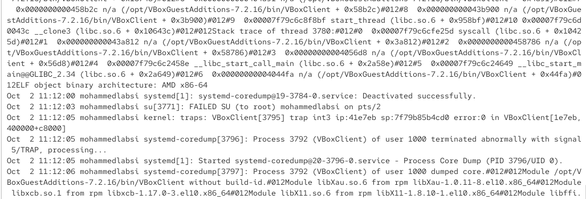
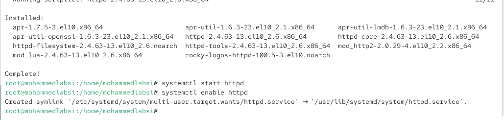
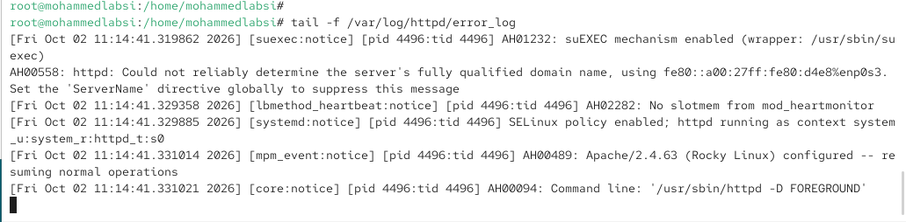
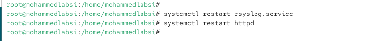
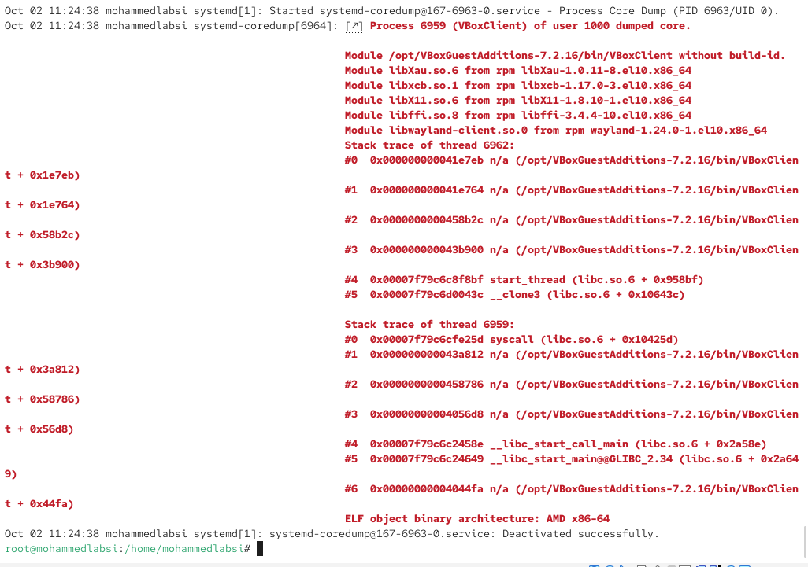
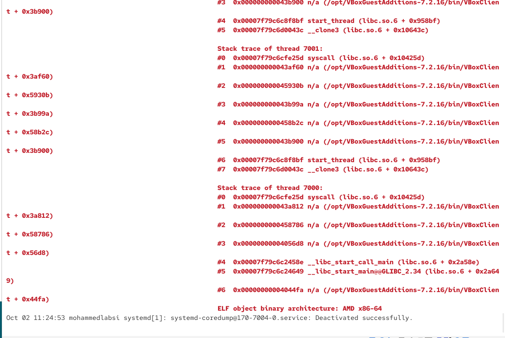
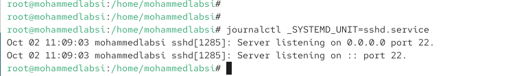

---
## Author
author:
  name: Лабси Мохаммед
  email: 1032245412@rudn.ru
  affiliation:
    - name: Российский университет дружбы народов
      country: Российская Федерация
      postal-code: 117198
      city: Москва
      address: ул. Миклухо-Маклая, д. 6

## Title
title: Лабораторная работа №7
subtitle: Управление журналами событий в системе
license: CC BY
date: today
date-format: "YYYY-MM-DD"
---

# Цели и задачи работы

## Цель лабораторной работы

Получить практические навыки работы с системными журналами Linux.

Изучить мониторинг событий в реальном времени, настройку `rsyslog`, работу с `journalctl`, фильтрацию системных сообщений и настройку постоянного хранения журнала `journald`.

# Мониторинг системных событий

## Отслеживаю системный журнал

{ #fig:001 width=70% height=70% }

## Проверяю работу команды logger

{ #fig:002 width=70% height=70% }

## Просматриваю журнал безопасности

{ #fig:003 width=70% height=70% }

# Настройка rsyslog

## Устанавливаю и запускаю Apache

{ #fig:004 width=70% height=70% }

## Просматриваю журнал ошибок Apache

{ #fig:005 width=70% height=70% }

## Настраиваю передачу сообщений через syslog

{ #fig:006 width=70% height=70% }

## Создаю отдельный журнал Apache

{ #fig:007 width=70% height=70% }

## Перезапускаю службы

{ #fig:008 width=70% height=70% }

## Проверяю сообщения Apache

{ #fig:009 width=70% height=70% }

# Настройка отладочного журнала

## Создаю файл debug.conf

{ #fig:010 width=70% height=70% }

## Проверяю регистрацию debug-сообщений

{ #fig:011 width=70% height=70% }

# Работа с journalctl

## Просматриваю системный журнал

{ #fig:012 width=70% height=70% }

## Просматриваю журнал без пейджера

{ #fig:013 width=70% height=70% }

## Запускаю journalctl в реальном времени

{ #fig:014 width=70% height=70% }

## Изучаю параметры фильтрации

{ #fig:015 width=70% height=70% }

## Фильтрую события по UID

{ #fig:016 width=70% height=70% }

## Просматриваю последние записи журнала

{ #fig:017 width=70% height=70% }

## Фильтрую сообщения по уровню ошибки

{ #fig:018 width=70% height=70% }

## Просматриваю события за период

{ #fig:019 width=70% height=70% }

## Просматриваю ошибки за период

{ #fig:020 width=70% height=70% }

## Использую подробный формат вывода

{ #fig:021 width=70% height=70% }

## Просматриваю журнал службы sshd

{ #fig:022 width=70% height=70% }

# Постоянный журнал journald

## Настраиваю постоянное хранение журнала

{ #fig:023 width=70% height=70% }

# Выводы по проделанной работе

## Вывод

В ходе лабораторной работы были изучены средства управления системными журналами Linux.

Был освоен мониторинг событий в реальном времени с помощью `tail -f`, а также регистрация пользовательских сообщений командой `logger`.

Была выполнена настройка `rsyslog` для перенаправления сообщений веб-службы Apache в отдельный файл журнала и создан отдельный журнал для отладочных сообщений.

Также были изучены основные возможности команды `journalctl`: просмотр журнала, работа в режиме реального времени, фильтрация по UID, приоритету, времени и системной службе.

В завершение было настроено постоянное хранение журнала `systemd-journald` в каталоге `/var/log/journal`.