---
## Author
author:
  name: Лабси Мохаммед
  email: 1032245412@rudn.ru
  affiliation:
    - name: Российский университет дружбы народов
      country: Российская Федерация
      postal-code: 117198
      city: Москва
      address: ул. Миклухо-Маклая, д. 6

## Title
title: "Отчёт по лабораторной работе №7"
subtitle: "Управление журналами событий в системе"
license: "CC BY"
---

# Цель работы

Получить навыки работы с журналами мониторинга различных событий в системе.

# Выполнение лабораторной работы

## Мониторинг журнала системных событий в реальном времени

Получаю полномочия администратора в терминалах с помощью команды:

`su -`

Во второй вкладке терминала запускаю просмотр системного журнала `/var/log/messages` в режиме реального времени:

`tail -f /var/log/messages`

В третьей вкладке возвращаюсь к обычной учётной записи пользователя и выполняю попытку получения полномочий администратора с неверным паролем. В журнале фиксируется неудачная попытка аутентификации пользователя `mohammedlabsi` при использовании команды `su`. В частности, появляется запись `FAILED SU (to root)`, указывающая на отказ при попытке перехода к учётной записи `root` (см. рис. [@fig-001]).

{ #fig-001 width=70% }

Для проверки регистрации произвольного сообщения средствами системного журнала в пользовательском терминале выполняю:

`logger hello`

Команда `logger` передаёт указанное сообщение системе журналирования. В терминале, где выполняется команда `tail -f /var/log/messages`, появляются строки с сообщением `hello`, связанным с пользователем `mohammedlabsi`. Это подтверждает, что созданное сообщение было принято и записано в системный журнал (см. рис. [@fig-002]).

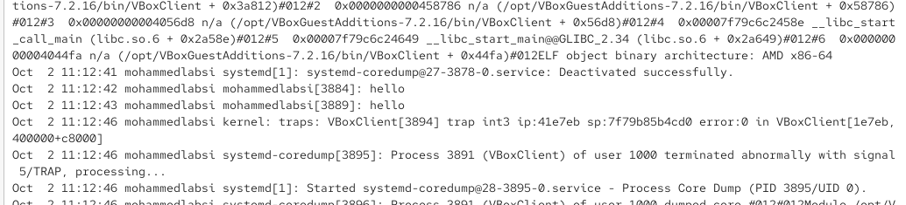{ #fig-002 width=70% }

Останавливаю мониторинг `/var/log/messages` сочетанием клавиш `Ctrl + c` и просматриваю последние 20 записей журнала безопасности:

`tail -n 20 /var/log/secure`

В полученном выводе присутствуют сведения об открытии сеансов пользователей, а также сообщения об ошибке проверки пароля. В частности, отображаются строки `password check failed for user (root)` и `authentication failure`, относящиеся к выполненной ранее неудачной попытке авторизации через `su`. Это показывает, что события, связанные с аутентификацией и безопасностью, сохраняются в файле `/var/log/secure` (см. рис. [@fig-003]).

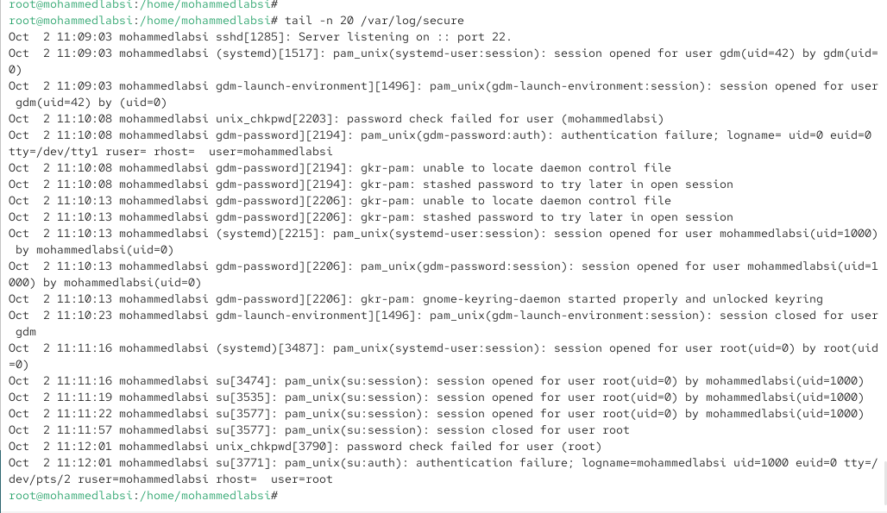{ #fig-003 width=70% }

## Настройка регистрации событий веб-службы через rsyslog

Для настройки отдельного журнала событий веб-службы устанавливаю Apache HTTP Server с помощью пакетного менеджера DNF:

`dnf -y install httpd`

После завершения установки запускаю службу `httpd`:

`systemctl start httpd`

Добавляю её в автоматический запуск при загрузке операционной системы:

`systemctl enable httpd`

Команда `enable` создаёт символическую ссылку:

`/etc/systemd/system/multi-user.target.wants/httpd.service -> /usr/lib/systemd/system/httpd.service`

Следовательно, веб-сервер запущен и настроен на автоматический запуск при последующих загрузках системы (см. рис. [@fig-004]).

{ #fig-004 width=70% }

Во второй вкладке терминала запускаю мониторинг стандартного журнала ошибок Apache:

`tail -f /var/log/httpd/error_log`

В журнале отображаются сообщения о запуске веб-сервера. Среди них присутствует уведомление о невозможности однозначно определить полное доменное имя сервера, информация о политике SELinux, версия Apache и сообщение о переходе сервера к нормальной работе. Это подтверждает, что изначально Apache записывает сообщения об ошибках в собственный файл `/var/log/httpd/error_log` (см. рис. [@fig-005]).

{ #fig-005 width=70% }

Для перенаправления сообщений Apache в системный журнал открываю файл конфигурации:

`/etc/httpd/conf/httpd.conf`

В конец файла добавляю строку:

`ErrorLog syslog:local1`

Директива `ErrorLog` указывает Apache передавать сообщения журнала ошибок через `syslog`, используя объект `local1`. Объекты `local0`–`local7` предназначены для пользовательской настройки регистрации событий различных приложений (см. рис. [@fig-006]).

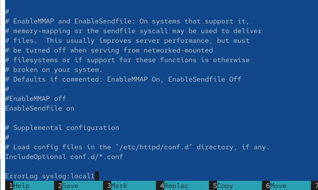{ #fig-006 width=70% }

Перехожу в каталог дополнительных конфигурационных файлов `rsyslog`:

`cd /etc/rsyslog.d`

Создаю файл настройки для событий веб-службы:

`touch httpd.conf`

В файл `/etc/rsyslog.d/httpd.conf` добавляю правило:

`local1.* -/var/log/httpd-error.log`

Данное правило направляет сообщения всех уровней приоритета, поступающие через объект `local1`, в отдельный файл `/var/log/httpd-error.log`. Символ `-` перед именем файла позволяет использовать асинхронную запись сообщений (см. рис. [@fig-007]).

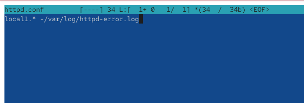{ #fig-007 width=70% }

Для применения созданной конфигурации перезапускаю службу `rsyslog`:

`systemctl restart rsyslog.service`

Затем перезапускаю Apache:

`systemctl restart httpd`

Команды выполняются без сообщений об ошибках, следовательно, изменённые конфигурации служб успешно применены (см. рис. [@fig-008]).

{ #fig-008 width=70% }

Дополнительно наблюдаю за журналом Apache:

`tail -f /var/log/httpd/error_log`

При перезапуске службы в журнале появляется сообщение:

`AH00492: caught SIGWINCH, shutting down gracefully`

Эта запись соответствует корректной остановке ранее работавшего процесса Apache перед его повторным запуском (см. рис. [@fig-009]).

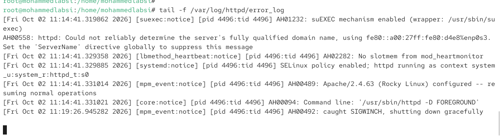{ #fig-009 width=70% }

Для отдельного мониторинга отладочной информации создаю ещё один конфигурационный файл `rsyslog`:

`cd /etc/rsyslog.d`

`touch debug.conf`

В файл `debug.conf` добавляю правило:

`*.debug /var/log/messages-debug`

Проверяю его содержимое командой:

`cat debug.conf`

Правило `*.debug` обеспечивает запись сообщений уровня `debug` от всех объектов `syslog` в файл `/var/log/messages-debug` (см. рис. [@fig-010]).

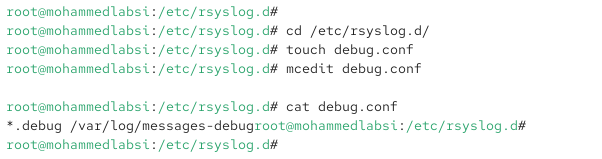{ #fig-010 width=70% }

После изменения конфигурации перезапускаю `rsyslog`:

`systemctl restart rsyslog.service`

Во второй вкладке терминала запускаю наблюдение за созданным журналом:

`tail -f /var/log/messages-debug`

Для проверки работы правила в другой вкладке терминала создаю отладочное сообщение:

`logger -p daemon.debug "Daemon Debug Message"`

В файле `/var/log/messages-debug` появляются строки `Daemon Debug Message`, созданные процессом `logger`. Это подтверждает, что правило `*.debug /var/log/messages-debug` работает и сообщения с уровнем `debug` успешно записываются в отдельный файл (см. рис. [@fig-011]).

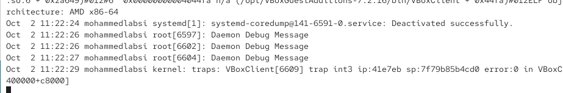{ #fig-011 width=70% }

## Работа с journalctl

Для просмотра системного журнала `systemd-journald` выполняю:

`journalctl`

Команда выводит журнал событий, начиная с сообщений, относящихся к загрузке системы. В начале отображается информация о версии ядра Linux, параметрах командной строки ядра, карте физической памяти, используемой виртуальной среде и других системных событиях. Просмотр осуществляется через пейджер, из которого можно выйти клавишей `q` (см. рис. [@fig-012]).

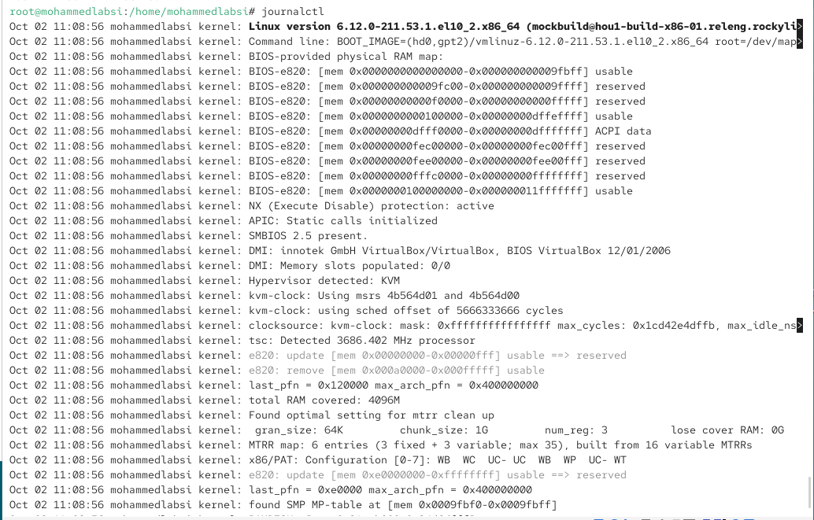{ #fig-012 width=70% }

Для вывода журнала без использования пейджера применяю:

`journalctl --no-pager`

В этом режиме содержимое журнала выводится непосредственно в терминал, после чего управление возвращается командной оболочке. В журнале, помимо обычных системных сообщений, присутствуют сведения о завершении процессов и создании дампов памяти, например сообщения `systemd-coredump` о процессе `VBoxClient` (см. рис. [@fig-013]).

{ #fig-013 width=70% }

Для наблюдения за новыми событиями по мере их появления использую режим реального времени:

`journalctl -f`

В этом режиме `journalctl` продолжает ожидать новые записи и сразу выводит их в терминал. В процессе наблюдения фиксируются новые системные события, включая сообщения `systemd-coredump`. Просмотр в реальном времени завершаю сочетанием клавиш `Ctrl + c` (см. рис. [@fig-014]).

{ #fig-014 width=70% }

Для просмотра доступных полей, по которым можно выполнять фильтрацию, ввожу:

`journalctl`

и дважды нажимаю клавишу `Tab`.

Командная оболочка предлагает вывести список доступных вариантов. Среди них присутствуют `_UID`, `_PID`, `_SYSTEMD_UNIT`, `_BOOT_ID`, `PRIORITY`, `SYSLOG_IDENTIFIER`, `_HOSTNAME` и множество других полей. Эти параметры можно использовать для выборки только интересующих событий из журнала (см. рис. [@fig-015]).

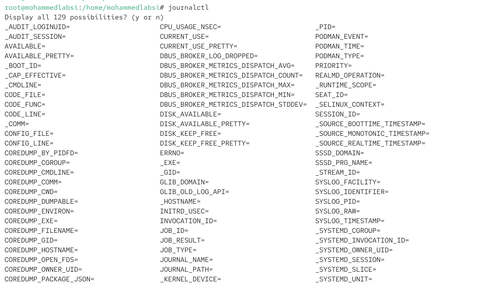{ #fig-015 width=70% }

Для отображения событий, связанных с пользователем с идентификатором `UID=0`, то есть с учётной записью `root`, выполняю:

`journalctl _UID=0`

В результате выводятся события, связанные с процессами, выполнявшимися от имени суперпользователя. Среди них присутствуют сообщения `systemd-journald`, `systemd-modules-load`, `systemd-sysusers`, `systemd` и других системных компонентов, запускаемых с административными полномочиями (см. рис. [@fig-016]).

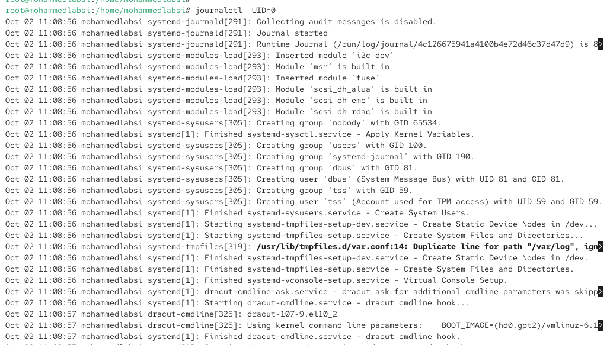{ #fig-016 width=70% }

Для отображения только последних 20 записей выполняю:

`journalctl -n 20`

Команда ограничивает вывод двадцатью наиболее свежими событиями журнала. В полученном результате присутствуют последние сообщения ядра и `systemd-coredump`, связанные с завершением процесса `VBoxClient` (см. рис. [@fig-017]).

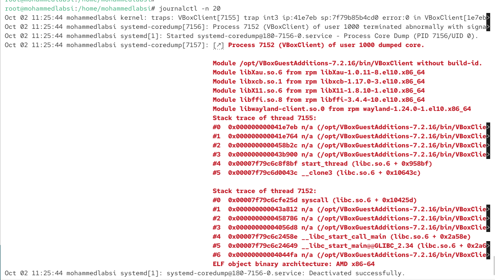{ #fig-017 width=70% }

Для просмотра сообщений с приоритетом ошибки использую:

`journalctl -p err`

В результате журнал фильтруется по уровню `err` и более высоким уровням серьёзности. В выводе отображаются сообщения об ошибках графического драйвера `vmwgfx`, ошибках `gkr-pam`, неудачном запуске одного из пользовательских компонентов и аварийных завершениях `VBoxClient` (см. рис. [@fig-018]).

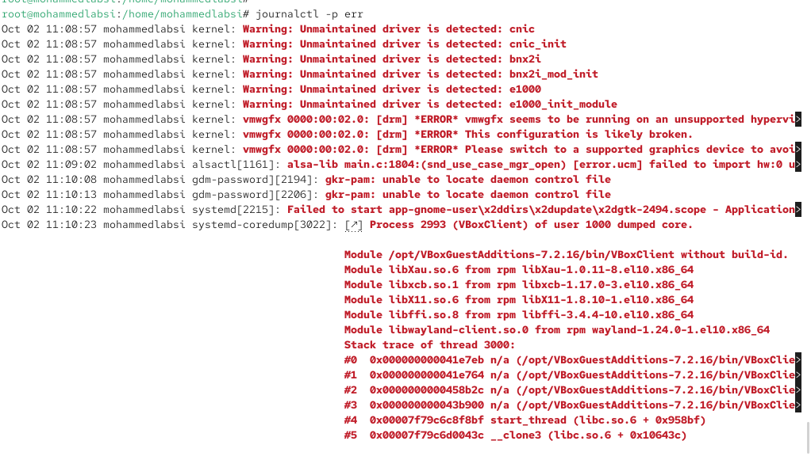{ #fig-018 width=70% }

Для выборки сообщений журнала по времени выполняю:

`journalctl --since yesterday`

Параметр `--since yesterday` ограничивает вывод событиями, зарегистрированными начиная со вчерашнего дня. В полученном журнале присутствуют сообщения текущего сеанса загрузки системы, начиная с информации об инициализации ядра Linux (см. рис. [@fig-019]).

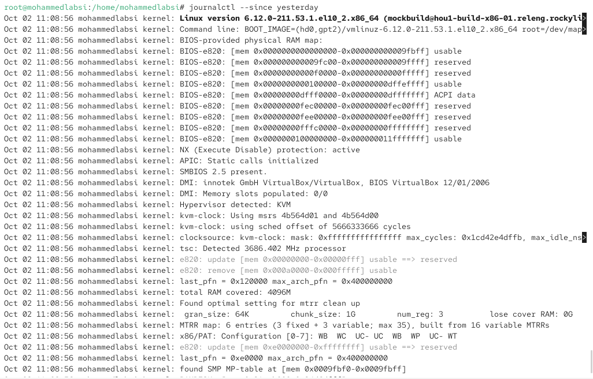{ #fig-019 width=70% }

Объединяю временную фильтрацию с фильтрацией по уровню важности:

`journalctl --since yesterday -p err`

Команда выводит только сообщения уровня `err` и более высокого уровня серьёзности, зарегистрированные начиная со вчерашнего дня. В результате отображаются ошибки драйверов, компонентов аутентификации и сообщения о завершении процессов (см. рис. [@fig-020]).

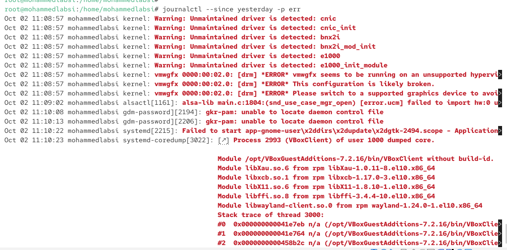{ #fig-020 width=70% }

Для получения максимально подробной информации о каждой записи использую:

`journalctl -o verbose`

Формат `verbose` выводит не только текст сообщения, но и набор связанных с ним служебных полей. Для каждой записи отображаются, например, `_SOURCE_BOOTTIME_TIMESTAMP`, `_TRANSPORT`, `PRIORITY`, `SYSLOG_FACILITY`, `SYSLOG_IDENTIFIER`, `_BOOT_ID`, `_MACHINE_ID`, `_HOSTNAME`, `_RUNTIME_SCOPE` и непосредственно поле `MESSAGE`. Такой формат удобен для детального анализа происхождения события и его метаданных (см. рис. [@fig-021]).

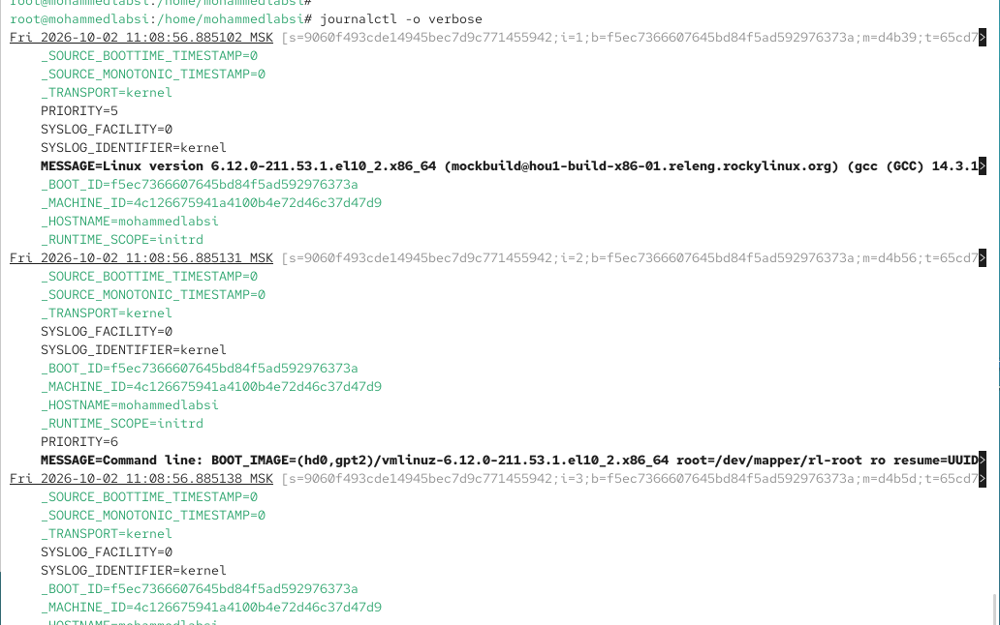{ #fig-021 width=70% }

Для просмотра сообщений только от службы SSH выполняю фильтрацию по системному модулю:

`journalctl _SYSTEMD_UNIT=sshd.service`

В результате отображаются сообщения, относящиеся к `sshd.service`. В журнале присутствуют записи о запуске SSH-сервера и прослушивании порта `22` по IPv4 и IPv6:

`Server listening on 0.0.0.0 port 22.`

`Server listening on :: port 22.`

Следовательно, фильтрация по полю `_SYSTEMD_UNIT` позволяет получить журнал конкретной службы без вывода посторонних системных событий (см. рис. [@fig-022]).

{ #fig-022 width=70% }

## Настройка постоянного журнала journald

По умолчанию `systemd-journald` может использовать временное хранилище `/run/log/journal`, содержимое которого не сохраняется после перезагрузки. Для организации постоянного хранения создаю каталог:

`mkdir -p /var/log/journal`

Назначаю владельца и группу каталога:

`chown root:systemd-journal /var/log/journal/`

После этого задаю необходимые права доступа:

`chmod 2755 /var/log/journal/`

Значение `2755` устанавливает стандартные права чтения и выполнения для каталога и дополнительно устанавливает бит `setgid`, благодаря которому создаваемые внутри объекты наследуют группу каталога.

Для того чтобы `systemd-journald` начал использовать созданный каталог без полной перезагрузки операционной системы, отправляю процессу сигнал `USR1`:

`killall -USR1 systemd-journald`

После этого проверяю журнал текущей загрузки:

`journalctl -b`

Параметр `-b` ограничивает вывод сообщениями, относящимися к текущей загрузке системы. В результате отображаются записи начиная с запуска ядра Linux и последующей инициализации системы. Создание `/var/log/journal` и передача сигнала `USR1` обеспечивают переход `journald` к постоянному хранению журнала на диске (см. рис. [@fig-023]).

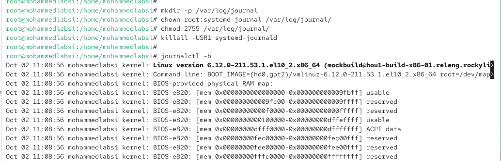{ #fig-023 width=70% }

## Контрольные вопросы

## Контрольные вопросы

1. **Какой файл используется для настройки rsyslogd?**  
   Основным файлом конфигурации службы **rsyslogd** является **/etc/rsyslog.conf**.  
   Дополнительные правила и отдельные настройки обычно размещаются в каталоге **/etc/rsyslog.d/** в файлах с расширением **.conf**.  
   Например, в лабораторной работе использовались файлы **/etc/rsyslog.d/httpd.conf** и **/etc/rsyslog.d/debug.conf**.

2. **В каком файле журнала rsyslogd содержатся сообщения, связанные с аутентификацией?**  
   Сообщения, связанные с аутентификацией пользователей, обычно записываются в файл **/var/log/secure**.  
   В нём можно найти сведения об успешных и неудачных попытках входа, использовании команды **su**, работе SSH и других событиях, относящихся к безопасности и проверке подлинности пользователей.

3. **Если вы ничего не настроите, то сколько времени потребуется для ротации файлов журналов?**  
   За ротацию системных журналов обычно отвечает утилита **logrotate**.  
   В стандартной конфигурации многих систем семейства RHEL журналы ротируются **еженедельно**, если для конкретного файла не задан другой режим.  
   Период ротации определяется настройками в файле **/etc/logrotate.conf** и дополнительных файлах каталога **/etc/logrotate.d/**. Поэтому при настройках по умолчанию ротация обычно выполняется один раз в неделю.

4. **Какую строку следует добавить в конфигурацию для записи всех сообщений с приоритетом info в файл /var/log/messages.info?**  
   Для записи сообщений уровня **info** необходимо добавить правило rsyslog:  
   **`*.info /var/log/messages.info`**  
   Символ `*` указывает на все средства регистрации событий, а **info** задаёт уровень приоритета. Сообщения с приоритетом **info** и более высоким уровнем важности будут направляться в файл **/var/log/messages.info**.

5. **Какая команда позволяет вам видеть сообщения журнала в режиме реального времени?**  
   Для просмотра системного журнала **journald** в режиме реального времени используется команда:  
   **`journalctl -f`**  
   Параметр **-f** работает аналогично команде **tail -f** и выводит новые сообщения сразу после их появления в журнале. Для завершения просмотра используется сочетание клавиш **Ctrl + c**.

6. **Какая команда позволяет вам видеть все сообщения журнала, которые были написаны для PID 1 между 9:00 и 15:00?**  
   Для фильтрации записей по идентификатору процесса и временному интервалу используется команда:  
   **`journalctl _PID=1 --since "09:00" --until "15:00"`**  
   Поле **_PID=1** ограничивает вывод сообщениями процесса с идентификатором 1, которым обычно является **systemd**, а параметры **--since** и **--until** задают начало и конец временного интервала.

7. **Какая команда позволяет вам видеть сообщения journald после последней перезагрузки системы?**  
   Для просмотра сообщений, относящихся к текущей загрузке системы, используется команда:  
   **`journalctl -b`**  
   Параметр **-b** ограничивает вывод записями, созданными после последней загрузки операционной системы.

8. **Какая процедура позволяет сделать журнал journald постоянным?**  
   Для организации постоянного хранения журнала необходимо создать каталог **/var/log/journal**, настроить его владельца и права доступа, после чего сообщить службе **systemd-journald** о необходимости начать использовать постоянное хранилище.  
   Для этого выполняются команды:  
   **`mkdir -p /var/log/journal`**  
   **`chown root:systemd-journal /var/log/journal`**  
   **`chmod 2755 /var/log/journal`**  
   Затем изменения можно применить без полной перезагрузки системы командой:  
   **`killall -USR1 systemd-journald`**  
   После этого журнал **journald** сохраняется в каталоге **/var/log/journal** и не теряется после перезагрузки операционной системы.

# Заключение

В ходе лабораторной работы были изучены средства ведения и анализа системных журналов Linux. Были освоены мониторинг событий в реальном времени, настройка **rsyslog**, работа с командой **journalctl**, фильтрация сообщений по различным параметрам, а также настройка постоянного хранения журнала **systemd-journald**. Полученные навыки позволяют контролировать системные события, анализировать ошибки и настраивать регистрацию сообщений служб.