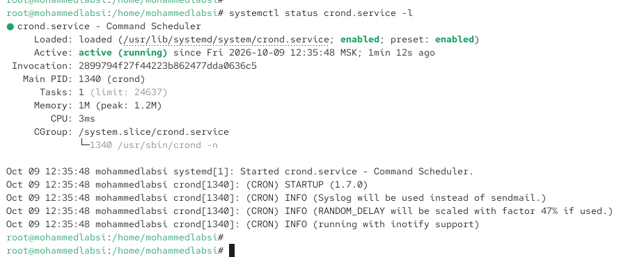
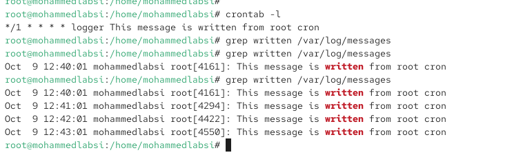
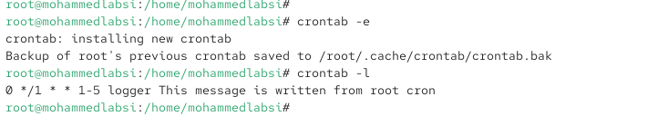

---
## Author
author:
  name: Лабси Мохаммед
  email: 1032245412@rudn.ru
  affiliation:
    - name: Российский университет дружбы народов
      country: Российская Федерация
      postal-code: 117198
      city: Москва
      address: ул. Миклухо-Маклая, д. 6

## Title
title: Лабораторная работа №8
subtitle: Планировщики событий
license: CC BY
date: today
date-format: "YYYY-MM-DD"
---

# Цели и задачи работы

## Цель лабораторной работы

Получить практические навыки планирования и автоматизации выполнения задач в операционной системе Linux.

Изучить работу служб `crond` и `atd`, настройку периодических и однократных заданий, создание сценариев автоматического выполнения команд и проверку результатов их работы через системный журнал.

# Планирование задач с помощью cron

## Проверяю состояние службы crond

{ #fig:001 width=70% height=70% }

## Просматриваю конфигурацию и расписание cron

{ #fig:002 width=70% height=70% }

## Создаю задание для ежеминутного выполнения

{ #fig:003 width=70% height=70% }

## Проверяю выполнение задания через системный журнал

{ #fig:004 width=70% height=70% }

## Изменяю расписание выполнения задания

{ #fig:005 width=70% height=70% }

# Настройка автоматического запуска сценариев

## Создаю сценарий eachhour

{ #fig:006 width=70% height=70% }

## Создаю системное расписание в каталоге cron.d

{ #fig:007 width=70% height=70% }

## Проверяю созданные сценарии и системный журнал

{ #fig:008 width=70% height=70% }

# Планирование заданий с помощью at

## Проверяю службу atd и создаю однократное задание

{ #fig:009 width=70% height=70% }

# Выводы по проделанной работе

## Вывод

В ходе лабораторной работы были изучены средства планирования и автоматизации выполнения задач в операционной системе Linux.

Была освоена работа с планировщиком `cron`: проверка состояния службы `crond`, создание и редактирование расписаний, настройка периодического выполнения команд.

Также была изучена работа планировщика `atd`, позволяющего назначать однократные задания на определённое время.
