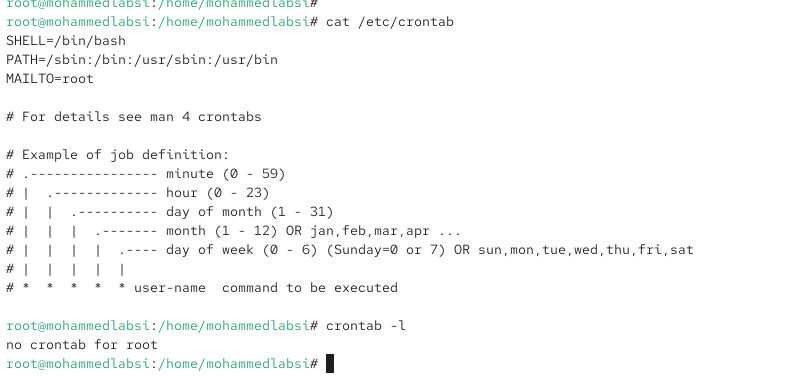
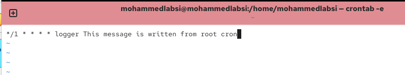
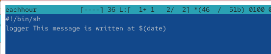
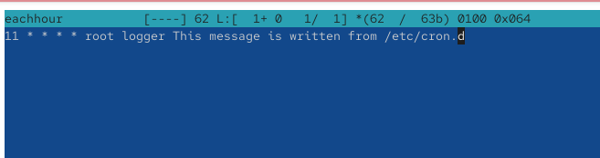
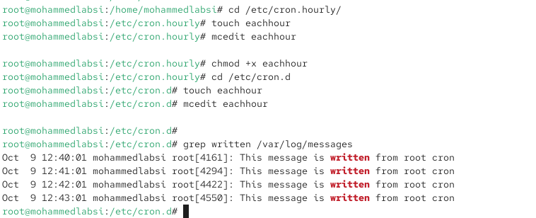
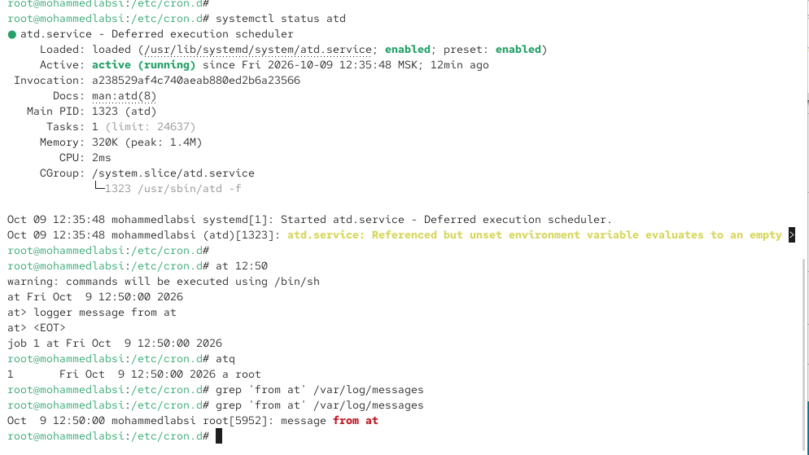

---
## Author
author:
  name: Лабси Мохаммед
  email: 1032245412@rudn.ru
  affiliation:
    - name: Российский университет дружбы народов
      country: Российская Федерация
      postal-code: 117198
      city: Москва
      address: ул. Миклухо-Маклая, д. 6

## Title
title: "Отчёт по лабораторной работе №8"
subtitle: "Планировщики событий"
license: "CC BY"
---

# Цель работы

Получение навыков работы с планировщиками событий cron и at.

# Выполнение лабораторной работы

## Планирование задач с помощью cron

Запускаю терминал и получаю полномочия администратора с помощью команды:

`su -`

Проверяю состояние службы планировщика задач `crond`:

`systemctl status crond.service -l`

В результате выполнения команды отображается информация о службе `crond.service — Command Scheduler`. Состояние `Loaded: loaded` указывает на то, что служба загружена, а параметр `enabled` подтверждает её включение в автоматический запуск. Статус `Active: active (running)` свидетельствует о том, что демон `crond` запущен и работает. В выводе также присутствуют сведения о времени запуска службы, идентификаторе основного процесса и сообщениях системного журнала (см. рис. [@fig-001]).

{ #fig-001 width=70% }

Просматриваю содержимое системного файла конфигурации планировщика cron:

`cat /etc/crontab`

В результате отображаются переменные окружения `SHELL`, `PATH` и `MAILTO`, а также комментарии с описанием формата записи запланированных заданий. Переменная `SHELL=/bin/bash` определяет используемую командную оболочку, `PATH` задаёт пути поиска исполняемых файлов, а `MAILTO=root` указывает получателя сообщений, формируемых при выполнении заданий.

Далее проверяю наличие заданий в расписании пользователя `root`:

`crontab -l`

Команда выводит сообщение `no crontab for root`, указывающее на отсутствие настроенного пользовательского расписания для администратора (см. рис. [@fig-002]).

{ #fig-002 width=70% }

Для создания нового задания открываю расписание на редактирование:

`crontab -e`

В открывшемся редакторе добавляю строку:

`*/1 * * * * logger This message is written from root cron`

Данная запись состоит из пяти полей времени и команды, которую необходимо выполнить.

Первое поле `*/1` задаёт выполнение каждую минуту. Второе поле `*` означает любой час, третье `*` — любой день месяца, четвёртое `*` — любой месяц, а пятое `*` — любой день недели. После полей расписания располагается команда `logger This message is written from root cron`, которая отправляет указанное текстовое сообщение в системный журнал.

Следовательно, созданное задание должно выполняться каждую минуту независимо от даты и времени суток.

После внесения записи сохраняю изменения и закрываю редактор (см. рис. [@fig-003]).

{ #fig-003 width=70% }

Проверяю сохранённое расписание командой:

`crontab -l`

В результате отображается ранее добавленная строка:

`*/1 * * * * logger This message is written from root cron`

Это подтверждает успешное сохранение задания в расписании пользователя `root`.

Для проверки фактического выполнения задания через несколько минут просматриваю записи системного журнала, содержащие слово `written`:

`grep written /var/log/messages`

В журнале обнаруживаются сообщения `This message is written from root cron`, зарегистрированные в `12:40:01`, `12:41:01`, `12:42:01` и `12:43:01`.

Сообщения создаются от имени пользователя `root` с помощью команды `logger`. Появление новых записей с интервалом приблизительно в одну минуту подтверждает, что демон `crond` выполняет запланированное задание в соответствии с установленным расписанием (см. рис. [@fig-004]).

{ #fig-004 width=70% }

Далее изменяю расписание задания, повторно открыв редактор:

`crontab -e`

Заменяю предыдущую запись следующей:

`0 */1 * * 1-5 logger This message is written from root cron`

В данной записи первое поле `0` задаёт нулевую минуту часа. Второе поле `*/1` означает выполнение каждый час. Третье и четвёртое поля `*` допускают любой день месяца и любой месяц соответственно. Пятое поле `1-5` ограничивает выполнение задания рабочими днями недели, с понедельника по пятницу.

Следовательно, команда `logger` будет выполняться в начале каждого часа по будним дням.

Сохраняю внесённые изменения и проверяю обновлённое расписание:

`crontab -l`

В выводе появляется новая запись `0 */1 * * 1-5 logger This message is written from root cron`. Это подтверждает успешное изменение параметров запуска задания (см. рис. [@fig-005]).

{ #fig-005 width=70% }

Для настройки периодического запуска отдельного сценария перехожу в каталог `/etc/cron.hourly`:

`cd /etc/cron.hourly`

Создаю файл сценария с именем `eachhour`:

`touch eachhour`

Открываю созданный файл для редактирования:

`mcedit eachhour`

Добавляю в него следующий скрипт:

`#!/bin/sh`

`logger This message is written at $(date)`

Первая строка `#!/bin/sh` указывает, что сценарий должен выполняться командной оболочкой `/bin/sh`.

Вторая строка содержит команду `logger`, которая отправляет сообщение в системный журнал. Конструкция `$(date)` выполняет команду `date` и подставляет в сообщение текущие дату и время выполнения сценария.

Размещение файла в каталоге `/etc/cron.hourly` предназначено для его периодического запуска средствами системного планировщика ежечасных заданий (см. рис. [@fig-006]).

{ #fig-006 width=70% }

После сохранения сценария назначаю ему право на выполнение:

`chmod +x eachhour`

Команда `chmod +x` устанавливает для файла атрибут исполнения, необходимый для запуска сценария.

Далее перехожу в каталог системных расписаний:

`cd /etc/cron.d`

Создаю файл расписания `eachhour`:

`touch eachhour`

Открываю его в текстовом редакторе:

`mcedit eachhour`

Добавляю следующую строку:

`11 * * * * root logger This message is written from /etc/cron.d`

В данном формате первые пять полей определяют время выполнения задания, шестое поле указывает пользователя, от имени которого запускается команда, а оставшаяся часть содержит непосредственно команду.

Первое поле `11` означает выполнение на одиннадцатой минуте каждого часа. Остальные четыре поля `*` разрешают выполнение в любой час, любой день месяца, любой месяц и любой день недели.

Поле `root` указывает, что команда должна выполняться с полномочиями администратора.

Команда `logger This message is written from /etc/cron.d` предназначена для записи указанного сообщения в системный журнал.

Следовательно, созданное расписание предусматривает запуск команды `logger` каждый час на одиннадцатой минуте от имени пользователя `root` (см. рис. [@fig-007]).

{ #fig-007 width=70% }

Проверяю выполненные действия в терминале. В каталоге `/etc/cron.hourly` создан файл `eachhour`, в который внесён сценарий с помощью редактора `mcedit`. После этого командой `chmod +x eachhour` установлены права на его выполнение.

В каталоге `/etc/cron.d` создан одноимённый файл с расписанием запуска команды `logger`.

Для проверки регистрации запланированных событий выполняю:

`grep written /var/log/messages`

В полученном выводе присутствуют четыре сообщения, ранее зарегистрированные в `12:40:01`, `12:41:01`, `12:42:01` и `12:43:01` при выполнении первоначального ежеминутного задания cron.

При этом новых сообщений от сценария `/etc/cron.hourly/eachhour` или задания из `/etc/cron.d/eachhour` в представленном выводе нет. Поскольку проверка выполнена вскоре после создания файлов, запуск новых заданий по расписанию на момент проверки не подтверждён. Для окончательной проверки необходимо дождаться соответствующего времени выполнения и повторно просмотреть журнал (см. рис. [@fig-008]).

{ #fig-008 width=70% }

## Планирование заданий с помощью at

Для работы с планировщиком однократных заданий `at` продолжаю использовать терминал с полномочиями администратора.

Проверяю состояние службы `atd`:

`systemctl status atd`

В результате отображается информация о службе `atd.service — Deferred execution scheduler`. Параметр `Loaded: loaded` подтверждает наличие загруженной службы, значение `enabled` указывает на её включение в автоматический запуск, а статус `Active: active (running)` свидетельствует о том, что демон запущен и готов выполнять отложенные задания.

Для проверки механизма однократного выполнения команд создаю задание на `12:50`:

`at 12:50`

После ввода команды появляется приглашение `at>`, предназначенное для ввода команд, которые необходимо выполнить в указанное время.

Ввожу команду записи сообщения в системный журнал:

`logger message from at`

Завершаю ввод задания сочетанием клавиш `Ctrl + d`.

Планировщик сообщает о создании задания с номером `1` и временем выполнения `Fri Oct 9 12:50:00 2026`.

Для проверки наличия задания в очереди выполняю:

`atq`

В результате отображается запись с идентификатором `1`, временем выполнения `Fri Oct 9 12:50:00 2026` и пользователем `root`. Это подтверждает, что задание успешно добавлено в очередь планировщика `at`.

Для проверки его выполнения просматриваю системный журнал:

`grep 'from at' /var/log/messages`

При первой проверке соответствующее сообщение отсутствует, поскольку запланированное время ещё не наступило.

После наступления указанного времени повторно выполняю команду:

`grep 'from at' /var/log/messages`

В результате в системном журнале появляется запись:

`Oct 9 12:50:00 mohammedlabsi root[5952]: message from at`

Наличие сообщения `message from at` с временной отметкой `12:50:00` подтверждает успешное выполнение запланированной команды демоном `atd`.

В отличие от `cron`, предназначенного для периодического выполнения заданий по расписанию, планировщик `at` позволяет назначить однократное выполнение команды в установленное время (см. рис. [@fig-009]).

{ #fig-009 width=70% }

## Контрольные вопросы

1. **Как настроить задание cron, чтобы оно выполнялось раз в 2 недели?**  
   Стандартный планировщик **cron** не поддерживает непосредственное указание интервала в две недели, поскольку его расписание основано на минутах, часах, днях месяца, месяцах и днях недели.  
   Для выполнения задания раз в две недели можно настроить еженедельный запуск сценария, который будет проверять количество прошедших недель и выполнять необходимую команду через неделю.  
   Например, в файл **crontab** можно добавить запись:

   `0 2 * * 0 /usr/local/bin/biweekly.sh`

   Она запускает сценарий **biweekly.sh** каждое воскресенье в 02:00. В самом сценарии можно использовать проверку:

   ```bash
   #!/bin/sh
   if [ $(( $(date +%s) / 604800 % 2 )) -eq 0 ]; then
       /usr/local/bin/task.sh
   fi
   ```

   Проверка определяет чётность количества полных недель, прошедших с начала эпохи Unix. В результате команда **task.sh** выполняется через одно воскресенье, то есть раз в две недели.

2. **Как настроить задание cron, чтобы оно выполнялось 1-го и 15-го числа каждого месяца в 2 часа ночи?**  
   Для выполнения задания первого и пятнадцатого числа каждого месяца в 02:00 необходимо добавить в **crontab** следующую запись:

   `0 2 1,15 * * /usr/local/bin/task.sh`

   Первое поле `0` обозначает нулевую минуту, второе `2` — два часа ночи, третье `1,15` — первое и пятнадцатое числа месяца. Символы `*` в четвёртом и пятом полях означают любой месяц и любой день недели.  
   Следовательно, команда будет выполняться два раза в месяц в 02:00 независимо от дня недели.

3. **Как настроить задание cron, чтобы оно выполнялось каждые 2 минуты каждый день?**  
   Для запуска задания каждые две минуты необходимо добавить в расписание следующую строку:

   `*/2 * * * * /usr/local/bin/task.sh`

   Выражение `*/2` в первом поле означает выполнение через каждые две минуты. Остальные поля содержат символ `*`, который обозначает отсутствие ограничений по часам, дням месяца, месяцам и дням недели.  
   В результате задание будет выполняться ежедневно, круглосуточно, в минуты `00`, `02`, `04`, `06` и далее до `58` каждого часа.

4. **Как настроить задание cron, чтобы оно выполнялось 19 сентября ежегодно?**  
   Для ежегодного выполнения задания 19 сентября можно использовать следующую запись:

   `0 0 19 9 * /usr/local/bin/task.sh`

   Первое поле `0` обозначает нулевую минуту, второе `0` — полночь, третье `19` — девятнадцатое число месяца, четвёртое `9` — сентябрь. Последний символ `*` допускает любой день недели.  
   Следовательно, команда будет запускаться ежегодно 19 сентября в 00:00. При необходимости время выполнения можно изменить, указав другие значения минут и часов.

5. **Как настроить задание cron, чтобы оно выполнялось каждый четверг сентября ежегодно?**  
   Для выполнения задания каждый четверг сентября необходимо добавить следующую запись:

   `0 0 * 9 4 /usr/local/bin/task.sh`

   Первые два поля `0 0` задают выполнение в полночь. Третье поле `*` разрешает любой день месяца, четвёртое `9` ограничивает выполнение сентябрём, а пятое `4` обозначает четверг.  
   В результате задание будет выполняться в 00:00 каждого четверга сентября ежегодно.

6. **Какая команда позволяет вам назначить задание cron для пользователя alice? Приведите подтверждающий пример.**  
   Для редактирования расписания другого пользователя администратор может использовать команду:

   `crontab -u alice -e`

   Параметр `-u alice` указывает пользователя, для которого изменяется расписание, а параметр `-e` открывает редактор заданий. Для выполнения команды необходимы соответствующие административные полномочия.

   Например, для ежедневной записи сообщения в системный журнал в 08:00 можно добавить строку:

   `0 8 * * * logger Scheduled task from alice`

   После сохранения расписания проверить его содержимое можно командой:

   `crontab -u alice -l`

   В результате должна отображаться добавленная запись. Это подтверждает, что задание назначено пользователю **alice** и будет выполняться от его имени ежедневно в 08:00.

7. **Как указать, что пользователю bob никогда не разрешено назначать задания через cron? Приведите подтверждающий пример.**  
   Управление доступом пользователей к планировщику **cron** осуществляется с помощью файлов **/etc/cron.allow** и **/etc/cron.deny**.

   Файл **/etc/cron.allow** содержит список пользователей, которым разрешено пользоваться командой **crontab**. Если данный файл существует, доступ предоставляется только перечисленным в нём пользователям.

   Файл **/etc/cron.deny** содержит список пользователей, которым запрещено пользоваться **crontab**, если файл **/etc/cron.allow** отсутствует.

   Для запрета пользователю **bob** можно добавить его имя в файл **/etc/cron.deny**:

   `echo bob >> /etc/cron.deny`

   Проверить добавленную запись можно командой:

   `cat /etc/cron.deny`

   В выводе должно присутствовать имя пользователя `bob`.

   Для проверки ограничения можно выполнить:

   `su - bob -c 'crontab -l'`

   При действующем запрете команда должна завершиться сообщением об отсутствии разрешения на использование **crontab**.

   Если существует файл **/etc/cron.allow**, необходимо убедиться, что пользователь **bob** в нём отсутствует, поскольку этот файл имеет приоритет над **/etc/cron.deny**.

   Данные ограничения запрещают пользователю самостоятельно управлять заданиями через **crontab**, но не отменяют уже существующие задания и не препятствуют администратору создавать задания от его имени.

8. **Вам нужно убедиться, что задание выполняется каждый день, даже если сервер во время выполнения временно недоступен. Как это сделать?**  
   Для выполнения периодических заданий, пропущенных из-за выключения или временной недоступности сервера, можно использовать планировщик **anacron**.

   В отличие от обычного **cron**, который не выполняет автоматически пропущенные задания, **anacron** учитывает дату последнего запуска и позволяет выполнить пропущенную задачу после восстановления работы системы.

   Например, в файл **/etc/anacrontab** можно добавить запись:

   `1 5 daily_task /usr/local/bin/task.sh`

   Первое поле `1` означает период выполнения в один день. Второе поле `5` определяет задержку запуска в пять минут. Третье поле `daily_task` задаёт уникальный идентификатор задания, а последняя часть содержит команду для выполнения.

   Если сервер был выключен в момент запланированного выполнения задания, **anacron** запустит пропущенную задачу после возобновления работы при очередном запуске самого планировщика и после установленной задержки.

   Также в системах с **systemd** можно использовать таймеры с параметром `Persistent=true`, который обеспечивает выполнение пропущенного календарного задания после повторной активации таймера.

   Для работы обоих механизмов необходимо, чтобы сервер впоследствии стал доступен и соответствующая служба планирования заданий была запущена.

9. **Какая команда позволяет узнать, запланированы ли какие-либо задания на выполнение планировщиком atd?**  
   Для просмотра очереди заданий, запланированных с помощью **at**, используется команда:

   `atq`

   Она отображает список ожидающих выполнения заданий с указанием идентификатора, времени запуска, очереди и пользователя, назначившего выполнение.

   Например, результат может выглядеть следующим образом:

   `1 Fri Oct 9 12:50:00 2026 a root`

   Здесь `1` — идентификатор задания, `Fri Oct 9 12:50:00 2026` — запланированные дата и время выполнения, `a` — имя очереди, а `root` — пользователь, от имени которого создано задание.

   Аналогичный результат можно получить командой:

   `at -l`

   Если очередь пуста, команды **atq** и **at -l** не выводят записей. После успешного выполнения однократное задание автоматически удаляется из очереди.

# Заключение

В ходе лабораторной работы изучил принципы планирования и автоматизации выполнения задач в Linux с помощью служб **crond** и **atd**. Научился создавать и редактировать расписания **cron**, настраивать периодический запуск команд и сценариев, а также назначать однократные задания с помощью **at**. Проверил работу планировщиков через системный журнал **/var/log/messages**. Получил практические навыки управления запланированными заданиями и контроля их выполнения.

# Список литературы

1. [Red Hat. Automating System Tasks — автоматизация выполнения задач в Linux с помощью cron, anacron и at](https://docs.redhat.com/en/documentation/red_hat_enterprise_linux/7/html/system_administrators_guide/ch-automating_system_tasks).

2. [Linux Manual Pages. crontab(5) — формат файлов расписания cron и синтаксис заданий](https://man7.org/linux/man-pages/man5/crontab.5.html).

3. [Linux Manual Pages. crontab(1) — управление расписанием заданий пользователей](https://man7.org/linux/man-pages/man1/crontab.1.html).

4. [Linux Manual Pages. at(1p) — планирование однократного выполнения команд](https://man7.org/linux/man-pages/man1/at.1p.html).

5. [Linux Manual Pages. anacron(8) — периодическое выполнение заданий с учётом пропущенных запусков](https://man7.org/linux/man-pages/man8/anacron.8.html).

6. [Linux Manual Pages. anacrontab(5) — настройка расписания заданий anacron](https://man7.org/linux/man-pages/man5/anacrontab.5.html).

7. [Linux Manual Pages. systemd.timer(5) — настройка таймеров systemd для автоматического запуска задач](https://man7.org/linux/man-pages/man5/systemd.timer.5.html).